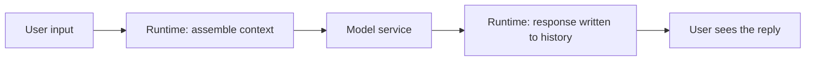

# 1-1 · The Agent Runtime: The Nature of the LLM Interface and the Framework's Responsibilities

> Reproduction requirements: Python 3.13+, uv, an available Flowing CLI, a DeepSeek API key, and network access from the terminal. To switch to OpenRouter's GPT-6 Luna, also set `OPENROUTER_API_KEY`.
> All configuration, prompts, inputs, and sample outputs needed for this example are included at the end of this chapter. Save each block under its stated filename in a new empty directory.

## What this chapter covers

This chapter builds the foundation of the concept of an agent: what properties
the external interface of a large language model (LLM) has, and why a runtime
layer is needed on top of the model, as well as what that layer is responsible
for.

## Background

The calling form that a large language model (LLM) exposes to the outside can
be summarized as:

```python
def llm(system_prompt: str, messages: list[Message]) -> str:
    ...
```

It takes instructions and conversation history as input and produces text as
output. This interface has three properties that matter in engineering:

1. **Text in, text out only.** The model has no direct access to the file
   system, the network, or the clock; the knowledge baked into its parameters
   has a cutoff date.
2. **No server-side session state.** Every call must resend the relevant
   history as a whole; the usable context length is bounded by the model's
   context window, and exceeding it fails the call.
3. **The output is probabilistic.** It is correct in most cases, but it can
   state wrong content with a confident tone (hallucination). Engineering
   must design validation and constraints around the assumption that "the
   output may be wrong."

## Core concepts

### Why a runtime layer is needed

Using the bare interface directly in a product runs into four problems, each
of which maps to a framework responsibility:

| Problem | Runtime responsibility |
|---|---|
| History, prompts, and tool definitions must be assembled by hand every turn | **Context assembly**: assemble the request under uniform rules |
| The model's output is intent; someone must execute the actions | **Execution authority**: the framework executes tool calls on the model's behalf, with interception possible before and after |
| A conversation must persist across requests and across processes | **State management**: persistence and recovery of history and business state |
| The output may be wrong and the actions may be dangerous | **Interception extension**: insert validation, approval, and rewriting at fixed points |

These four responsibilities define what an agent framework is. The conceptual
shape of a minimal call:

```python
result = agent_runtime.query(
    "Look up order 4521",
    system="You are an order assistant",  # context assembly
    tools=[query_order],                  # execution authority belongs to the framework
    history=conversation,                 # state: history is maintained by the client
)
```

The path of one question-and-answer exchange inside the runtime:



Other frameworks divide these responsibilities in much the same way; the
differences lie in the boundaries and the defaults.

### Who maintains the conversation history

The model server keeps no session. The "conversation" that the user
experiences is the result of the framework maintaining history locally and
replaying it in full on every turn.

Start the session using the complete example at the end of this chapter and
ask two questions in the same session. The transcript below is illustrative;
model wording may vary; reasoning traces are not shown:

```console
(agent-main)>>> Tell me about yourself in one sentence.
[thinking] (reasoning trace omitted)
I'm a concise English assistant designed to give helpful, clear answers within three sentences.
(agent-main)>>> What did I just ask you?
[thinking] (reasoning trace omitted)
You asked me to tell you about myself in one sentence.
```

Line by line: after the prompt `(agent-main)>>>` comes the question you
typed, followed by the model's answer; reasoning traces are omitted here.
In the first turn you
asked "Tell me about yourself in one sentence", and the model answered in one
sentence; in the second turn your new question was only a few words long, yet
the model accurately recalled the first question. The model server saved
nothing between the two turns — the only explanation for the first question
appearing in the second answer is that the runtime packed the entire
first-turn message history into the second-turn request. This is direct
evidence that "history is maintained by the client."

This fact has two direct corollaries:

- The longer the conversation, the larger every request becomes, and cost and
  latency rise accordingly; the context budget is therefore a routine
  observability item in agent systems;
- Whoever holds the history can rewrite, trim, and branch it, so context
  engineering is one of the main development activities in agent
  development.

### The position of the system prompt

The instruction text carried in every request declares the agent's role and
way of working. Its influence on model behavior is probabilistic: it raises
the likelihood of compliance but constitutes no guarantee. Constraining
behavior is the job of the tool table (Chapter 1-3) and the interception
mechanism (Chapter 2-4); the system prompt is responsible for guidance.

The system prompt is assembled on the spot before every request, so it can
carry values injected at runtime. The second launch command in the complete
example at the end of this chapter demonstrates this:

```console
$ uv run flowing repl . --user_name Alice
```

The illustrative conversation is shown below. Model wording may vary; internal
reasoning is not shown:

```console
(agent-main)>>> What is my name? Answer with just the name itself.
[thinking] (reasoning trace omitted)
Alice
```

Line by line: you asked "What is my name?", and the model answered "Alice".
This name never appeared in the history of this session — it was injected
from the startup argument `--user_name Alice` through the entry point into
the system prompt template; the model only learned the name by reading the
prompt in the request. The system prompt is not a static file but a product
assembled on the spot by the runtime before every request.

## Common misconceptions

1. **Treating the system prompt as a constraint mechanism.** The prompt
   raises the probability of compliance; capability boundaries and control
   of dangerous actions should rest on the tool table and the interception
   points;
2. **Believing the model server remembers the session.** Cross-turn memory
   is maintained entirely by the client — when "the model forgot", check the
   local history and the recovery logic first.

## Exercises

1. Pick a conversational product you have used, and identify which of its
   features belong to runtime responsibilities (prompt templates, tools,
   memory, moderation) and which belong to the model itself;
2. Start a new session using the complete example below and ask "which turn
   of our conversation is this"; ask again in the same session, compare the
   answers, and explain how history replay affects them.

## Complete example: runtime, prompt, and conversation

The following content forms a complete minimal conversation. Create the
listed files in an empty directory. Replace `...` with your own credential
and set it only as an environment variable;
do not put a real credential in a file.

`pyproject.toml`:

```toml
[project]
name = "flowing-chapter-1-1"
version = "0.1.0"
requires-python = ">=3.13"
dependencies = ["flowing-agent"]

[tool.uv]
package = false
```

`main.py`:

```python
from flowing import Runtime


async def main(user_name: str | None = None,
               resume: str | None = None) -> Runtime:
    runtime = Runtime(persist_dir="@/.flowing")
    # runtime.set_providers("@/providers.yaml")
    # runtime.set_models("@/models.yaml")
    runtime.set_model_tags("@/model-tags.yaml")
    if resume is not None:
        await runtime.recover_agent(resume)
    else:
        root = await runtime.mount("@/root.fya", agent_id="agent-main")
        if user_name is not None:
            root.user_name = user_name
    return runtime
```

`root.fya` (the `$system_prompt` section is the complete prompt for this example):

```yaml
description: Minimal Q&A assistant
model_tag: default
---
$system_prompt:
You are a concise English assistant. Keep your answers within three sentences. The user is named {{ user_name }}; you may address them by name in your answers.
```

`providers.yaml`:

```yaml
deepseek:
  adapter: deepseek
  base_url: https://api.deepseek.com
  api_key: "{{env.DEEPSEEK_API_KEY}}"
openrouter:
  adapter: openrouter
  base_url: https://openrouter.ai/api/v1
  api_key: "{{env.OPENROUTER_API_KEY}}"
```

`models.yaml`:

```yaml
deepseek-flash:
  provider: deepseek
  model: deepseek-v4-flash
openrouter-gpt-6-luna:
  provider: openrouter
  model: openai/gpt-6-luna
  "reasoning.effort": high
```

`model-tags.yaml`:

```yaml
tags:
  default: deepseek-flash
  luna: openrouter-gpt-6-luna
```

The `default` tag still selects DeepSeek. Change `model_tag` in `root.fya` to
`luna` to call `openai/gpt-6-luna` through OpenRouter. The literal extension key
`"reasoning.effort": high` belongs to the GPT-6 Luna model entry and is sent to
OpenRouter with that model; the DeepSeek entry has no such setting. If
`OPENROUTER_API_KEY` is unset, configuration loading warns and the `default` tag
can still use DeepSeek; the `luna` entry requires that key.

Run these commands from the directory containing the files:

```sh
uv sync
export DEEPSEEK_API_KEY="..."
uv run flowing repl .
```

Complete input for the first session (enter each line; `/exit` ends the session):

```text
Tell me about yourself in one sentence.
What did I just ask you?
/exit
```

Illustrative output (wording varies by model; internal reasoning is represented by a placeholder):

```console
(agent-main)>>>Tell me about yourself in one sentence.
[thinking] (reasoning trace omitted)
I'm a concise English assistant designed to give helpful, clear answers within three sentences.
(agent-main)>>>What did I just ask you?
[thinking] (reasoning trace omitted)
You asked me to tell you about myself in one sentence.
(agent-main)>>>/exit
```

The second launch mode and its complete input are:

```console
$ uv run flowing repl . --user_name Alice
```

```text
What is my name? Answer with just the name itself.
/exit
```

```console
(agent-main)>>>What is my name? Answer with just the name itself.
[thinking] (reasoning trace omitted)
Alice
(agent-main)>>>/exit
```

## Summary

1. The LLM interface takes text only, has no server-side state, and produces
   probabilistic output;
2. The runtime layer assumes four responsibilities: context assembly,
   execution authority, state management, and interception extension;
3. Conversation history is maintained and replayed by the client; context
   engineering is the main development work;
4. The system prompt is responsible for guidance and is assembled on the spot
   before every request.
