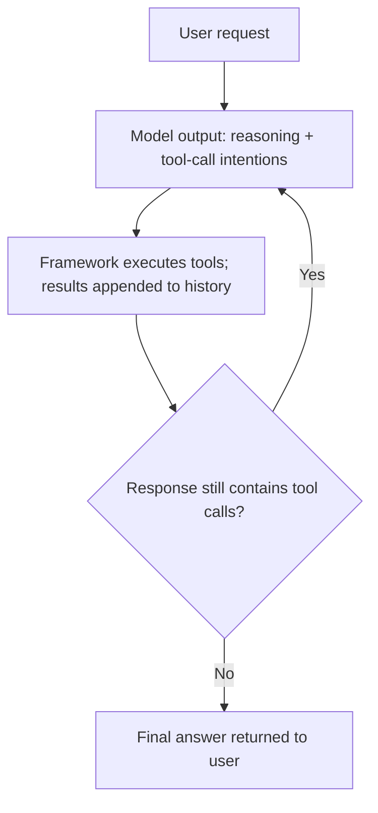

# 1-4 · The ReAct Loop: Alternating Problem-Solving and Termination Conditions

> Reproduction requirements: Python 3.13+, uv, an available Flowing CLI, a DeepSeek API key, and network access from the terminal.
> Complete configuration, scripts, prompts, data, inputs, and sample outputs are included at the end of this chapter. Save each block under its stated filename in a new empty directory before running it.

> Prerequisites: Chapter 1-2 "Tool Calling"

## What this chapter covers

The basic problem-solving structure of an agent: the ReAct loop, in which
reasoning and tool calls alternate; the explicit termination conditions of
the loop; and the runtime components that exist beyond the loop.

## Background

When the model is asked to output only the final answer, no external
information is available along the way; when the model calls tools step by
step without leaving a reasoning trail, later steps cannot build on earlier
thinking. The ReAct (Reason + Act) approach has the model output alternate
between two kinds of content: reasoning about the current situation (text),
and tool-call intentions based on that reasoning. Once an external
observation (a tool result) enters the history, the model continues
reasoning on that basis.

Compared with "reason everything through first, then execute", the
alternating approach feeds a real observation into every step,
intermediate results can correct later steps, and reliability is higher in
long tasks and multi-tool scenarios.

## Core concepts

### Loop structure

One complete problem-solving process:



Each "model call + possible tool execution" forms one iteration unit. The
framework defines this unit as a logical turn: it starts when a message is
consumed and ends when a response without tool calls is produced.

Start the complete example at the end of this chapter and give it a task that requires two tool calls: "First use glob to
see what files are in the notes directory, then use read to read 使用说明.md,
and finally summarize what it says in two sentences." The interaction below
illustrates the loop; all required input, data, and tool results are included
at the end of this chapter:

The complete visible input, tool calls, tool results, and final answer are
listed in the example at the end of this chapter; this section does not repeat
truncated paths or file contents.

Line by line, the alternation of the loop: in the first round the model
proposed only glob, the framework executed it and fed the result back; after
seeing the directory listing, the model proposed read in the second round —
the argument choices of the second call depend on the observation from the
first round, which is exactly the value of alternating problem-solving;
after reading the file, the third round contained no tool call, the loop
reached its main exit, and the final answer was returned. The turn leaves a
complete chain in history, with user messages, model responses, and tool
results alternating.

### Termination conditions

The loop must have an explicit exit; otherwise the model can "look it up
once more" without end. The standard exit is **the response no longer
contains tool-call intentions** (the example above ends this way); in
practice, auxiliary exits are usually added on top: budget caps (rounds /
tokens), time limits, and assertion conditions (for example, requiring the
final answer to contain a given marker).

The conceptual form of an assertion-based termination condition: at the end
of each round a predicate is checked; if it is not satisfied, a plain
message drives the next round, and only when it is satisfied may the loop
end:

```python
def finished(round_result) -> bool:
    return "DONE" in round_result.text     # completion marker defined by the application

# Framework behavior: if finished(response) is False, an instruction message
# is appended to start the next round; if True, the turn ends. A round cap is
# added on top to bound runaway behavior.
```

The complete configuration at the end of this chapter also includes a
runnable form of this assertion. Start it with a different command:

```console
$ uv run flowing repl . --strict done
```

Then enter "Reply with only the word 'OK' and do not add anything else." The
complete input and an illustrative output are:

```console
(agent-main)>>> Reply with only the word "OK" and do not add anything else.
OK
[steer] Acceptance condition not met: your final reply must contain DONE on its own line. Please answer the previous question again and append DONE at the end.
OK
```

Line by line: the model answered "OK" as requested; when the round ended,
the assertion check found no DONE in the reply, so the framework
automatically appended a steering message (the `[steer]` line) to drive a
new round; in the new round the model again answered "OK". This loop
continues indefinitely (terminate the session with `/exit`) — the assertion
exit is a termination condition that genuinely takes effect: the loop is
not allowed to end while the condition is unmet.

### The runtime beyond the loop

ReAct is a problem-solving algorithm, not a complete system. Beyond it you
still need:

- **Message queuing**: multiple inputs (user messages, external events,
  receipts from other agents) enter the loop in order (Chapter 2-1);
- **Concurrency and cancellation**: task execution must support interruption
  and preservation of partial results (Chapter 2-1);
- **History persistence**: session recovery across processes (Chapter 3-2);
- **Interception extension points**: inserting approval, rewriting, and
  observation before and after execution (Chapter 2-4).

## Complete example: a ReAct tool loop and an end-of-turn assertion

Create a `notes/` child directory in a new empty directory and save the
following files. Replace `...` with your API key and set it only as an
environment variable. Never place a real credential in a file. All runtime
code, declarations, prompts, inputs, and data are included here;
`<project-root>` is a machine-agnostic placeholder used in the sample output.

`pyproject.toml`:

```toml
[project]
name = "flowing-chapter-1-4"
version = "0.1.0"
requires-python = ">=3.13"
dependencies = ["flowing-agent"]

[tool.uv]
package = false
```

`main.py`:

```python
from flowing import Runtime


async def main(strict: str | None = None) -> Runtime:
    runtime = Runtime(persist_dir="@/.flowing")
    # runtime.set_providers("@/providers.yaml")
    # runtime.set_models("@/models.yaml")
    runtime.set_model_tags("@/model-tags.yaml")
    kwargs = {"strict": strict} if strict else {}
    await runtime.mount("@/root.fya", agent_id="agent-main", **kwargs)
    return runtime
```

`root.fya` (complete prompt, tool table, and end-of-turn logic):

```yaml
description: "Project Q&A assistant: can list directories, read files, and summarize."
model_tag: default
args:
  strict:
    type: string
    default: ""
    description: Set to done to require DONE in the final response
tools:
  - read
  - glob
---
$system_prompt:
You are a project Q&A assistant. The absolute path of this project's root is {{ env.PWD }} (always use this absolute path when calling file tools; do not guess other directories). When a question concerns project content, first use glob to inspect the directory structure, then use read to read the relevant files, and answer based on what you read; do not make things up from memory. Keep answers within five sentences.
---
$script:
from flowing import MessageKind, TextBlock
from flowing.composables import use_prompt_until


async def setup(self, strict: str = ""):
    if strict != "done":
        return

    def _done(agent, turn) -> bool:
        for mid in reversed(turn.message_ids):
            msg = agent.chain.get(mid)
            if msg.kind is MessageKind.PROVIDER:
                text = "".join(b.text for b in msg.content
                               if isinstance(b, TextBlock))
                return "DONE" in text
        return True

    use_prompt_until(
        self,
        predicate=_done,
        message=("Acceptance condition not met: your final reply must contain "
                 "DONE on its own line. Please answer the previous question "
                 "again and append DONE at the end."),
    )
```

`providers.yaml`:

```yaml
deepseek:
  adapter: deepseek
  base_url: https://api.deepseek.com
  api_key: "{{env.DEEPSEEK_API_KEY}}"
```

`models.yaml`:

```yaml
deepseek-flash:
  provider: deepseek
  model: deepseek-v4-flash
```

`model-tags.yaml`:

```yaml
tags:
  default: deepseek-flash
```

Run these commands from the directory containing the files:

```sh
uv sync
export DEEPSEEK_API_KEY="..."
uv run flowing repl .
uv run flowing repl . --strict done
```

Complete readable data:

`notes/使用说明.md`:

```markdown
# Usage

This directory is a demo notes library.

## Installation

Python 3.13 or later is required.

## Common commands

- `uv sync`: install dependencies
- `uv run pytest`: run tests

## Notes

Credentials must always be held in environment variables; never write them into any file.
```

`notes/路线图.md`:

```markdown
# Roadmap

- 2026-Q3: complete core functionality
- 2026-Q4: release version 1.0
```

Run `uv run flowing repl .` and enter:

```text
First use glob to see what files are in the notes directory, then use read to read 使用说明.md, and finally summarize what it says in two sentences.
/exit
```

Representative interaction (model wording may vary; tool result contents are
shown in full):

```console
(agent-main)>>>First use glob to see what files are in the notes directory, then use read to read 使用说明.md, and finally summarize what it says in two sentences.
[tool_call] glob {"pattern": "**/*", "path": "<project-root>/notes"}
[tool:completed] glob -> <project-root>/notes/使用说明.md
<project-root>/notes/路线图.md
[tool_call] read {"path": "<project-root>/notes/使用说明.md"}
[tool:completed] read -> 0  # Usage
1
2  This directory is a demo notes library.
3
4  ## Installation
5
6  Python 3.13 or later is required.
7
8  ## Common commands
9
10 - `uv sync`: install dependencies
11 - `uv run pytest`: run tests
12
13 ## Notes
14
15 Credentials must always be held in environment variables; never write them into any file.
The notes directory contains two files. The usage note describes a demo notes library, requires Python 3.13 or later, and lists commands for installing dependencies and running tests. It also says to keep credentials in environment variables.
(agent-main)>>>/exit
```

The input and launch command for the end-of-turn assertion are:

```console
$ uv run flowing repl . --strict done
```

```text
Reply with only the word "OK" and do not add anything else.
/exit
```

The representative interaction below deliberately omits `DONE`, so the
assertion asks the model to answer again; enter `/exit` to end the session.
To satisfy the assertion, ask: "Introduce yourself in one sentence and
append DONE at the end." The final response must contain `DONE` on its own
line.

```console
(agent-main)>>>Reply with only the word "OK" and do not add anything else.
OK
[steer] Acceptance condition not met: your final reply must contain DONE on its own line. Please answer the previous question again and append DONE at the end.
OK
(agent-main)>>>/exit
```

The tool calls and results above are included in full; model wording may vary.

## Common misconceptions

1. **Relying on implicit termination of the loop**. A loop without an exit
   condition risks running out of control; termination conditions are part
   of the system configuration;
2. **Treating ReAct as a complete architecture**. It defines only the
   internal structure of a single problem-solving process; queuing,
   persistence, and interception are separate system components;
3. **Leaving the iteration unit uncapped**. Even with a correct termination
   condition, round and token budgets should be added on top to bound the
   cost of failures.

## Exercises

1. Design the iteration sequence (reasoning → call → observation) of a
   ReAct loop for the task "research an open-source library and write an
   evaluation report", and mark the verifiable observation at each step;
2. Give three termination conditions for this task (one main exit plus two
   auxiliary caps) and explain the failure mode each one guards against;
3. In the `--strict done` session of the complete example below, ask an ordinary
   question with a normal DONE-ending requirement (for example, "introduce
   yourself in one sentence and append DONE at the end") and observe the
   loop ending normally once the assertion is satisfied.

## Summary

1. The ReAct loop alternates reasoning and action, and observations correct
   later steps;
2. Each iteration unit constitutes one logical turn;
3. Termination conditions are explicit configuration: the main exit is "no
   tool calls", and auxiliary caps guard against runaway behavior;
4. Beyond the loop you still need queuing, concurrency, persistence, and
   interception, discussed in Chapters 2 and 3 respectively.
