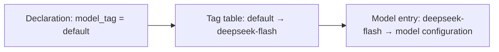

# 2-3 · Assembly and Parameterization: Schema as Contract and Creation-Time Validation

> Prerequisites: Flowing CLI is installed and `DEEPSEEK_API_KEY` is set in the environment. Every file needed to run the example is included below; execute the commands in the working directory containing those files.
> Run: `uv run flowing repl . --user_name Alice --locale en`
> Continue the conversation: run the same command in the same working directory. Use a fresh working directory for the missing-argument case.

> Prerequisites: Chapter 1-1 "The Agent Runtime"

## What this chapter covers

How an agent is assembled as a reusable component: the separation of
declaration and assembly, the parameter schema as a contract,
creation-time validation, and the indirection layer from logical names
to physical implementations.

## Background

When the same agent logic serves different users and different
environments, the differences should enter as parameters rather than as
copied code. Parameterization is the basic mechanism of component reuse;
the engineering part of the problem is how parameters are declared, how
they are validated, and where they are assembled.

## Core concepts

### The three-way division of declaration, assembly, and configuration

The files of an agent project fall into three categories by
responsibility:

| Layer | Content | Reason to change |
|---|---|---|
| Declaration | What the agent is: role, capabilities, prompt | Change behavior |
| Assembly | How it is created: construction, mounting, dependency injection | Change the way it is assembled |
| Configuration | Runtime environment: model, credentials, switches | Change the environment |

The benefit of the three-way division is the usual benefit of
composition: behavior, assembly, and environment each evolve without
entangling one another. In the dependency-injection literature, the
assembly layer is called the composition root — the whole object graph
is assembled in a single auditable place.

The complete materials below demonstrate the three-way division: the
agent declaration defines its role, parameters, and prompt; the entry
function creates the runtime, registers configuration, and mounts the
agent; the configuration describes the model service, model entry, and
tag mapping.

### Complete example materials

Together, the following blocks form a minimal runnable example. Each
block heading gives the relative filename to create, and the full file
contents appear in the block. Model credentials are supplied only
through the `DEEPSEEK_API_KEY` environment variable.

#### `root.fya`

```yaml
description: "Parameter demo assistant: args declaration + typical setup() pattern."
model_tag: default
args:
  user_name: str
  locale:
    type: string
    default: zh
    description: "Reply language (zh / en)"
---
$system_prompt:
You are a concise Q&A assistant. Current user: {{ user_name }}; reply language: {{ locale }};
timezone: {{ timezone }}. Keep your answer within one sentence.
---
$script:
async def setup(self, user_name: str, locale: str = "zh"):
    self.user_name = user_name
    self.locale = locale
    self.ask_count = 0
    self.provide("locale", locale)
    self.timezone = self.inject("timezone")
```

#### `main.py`

```python
from flowing import Runtime


async def main(user_name: str | None = None, locale: str = "zh") -> Runtime:
    runtime = Runtime(persist_dir="@/.flowing")
    # runtime.set_providers("@/providers.yaml")
    # runtime.set_models("@/models.yaml")
    runtime.set_model_tags("@/model-tags.yaml")
    runtime.provide("timezone", "Asia/Shanghai")
    kwargs: dict = {}
    if user_name is not None:
        kwargs["user_name"] = user_name
    if locale != "zh":
        kwargs["locale"] = locale
    await runtime.mount("@/root.fya", agent_id="agent-main", **kwargs)
    return runtime
```

#### `providers.yaml`

```yaml
deepseek:
  adapter: deepseek
  base_url: https://api.deepseek.com
  api_key: "{{env.DEEPSEEK_API_KEY}}"
```

#### `models.yaml`

```yaml
deepseek-flash:
  provider: deepseek
  model: deepseek-v4-flash
```

#### `model-tags.yaml`

```yaml
tags:
  default: deepseek-flash
```

#### Conversation input and visible output

Run in the working directory containing the relative files above:

```console
$ uv run flowing repl . --user_name Alice --locale en
(agent-main)>>> Please report in one sentence: who is the current user, what is the locale, and what is the timezone?
[thinking] (reasoning trace omitted)
The current user is Alice, the locale is English (en), and the timezone is Asia/Shanghai.
```

To demonstrate a missing required argument, run this negative case in a
separate fresh working directory. A failed launch may already have created
partial session state, so do not run the normal command in that same state
directory afterward:

```console
$ uv run flowing repl .
launch failed: RootAgent.setup() missing 1 required positional argument: 'user_name'
```

### The parameter schema as a contract

Parameters are declared in the form of a schema: each parameter's name,
type, default value, and description. The schema serves three readers at
once:

- The constructor validates incoming arguments against it;
- the model-facing call surface (such as the parameter table in a
  subagent catalog) is generated from it;
- documentation readers understand the component's input surface from
  it.

One declaration takes effect in three places, so the schema must be
kept as a single source of truth; manually synchronizing multiple copies
drifts sooner or later. The complete agent declaration above uses two
equivalent parameter forms:

```yaml
args:
  user_name: str                 # required: bare-type shorthand
  locale:
    type: string
    default: zh                  # a default value makes it optional
    description: "Reply language (zh / en)"
```

Requiredness is derived from the presence of a default value:
`user_name` has no default and is therefore required, while `locale`
has a default and is therefore optional. The complete conversation input
and visible output appear in the example materials above.

Each of the three values in this answer has a distinct source: `Alice`
and `en` come from the command-line arguments (forwarded through the
assembly layer into the creation pipeline and then into the prompt
template), and `Asia/Shanghai` comes from a shared value that the
assembly layer registers with the runtime before mounting (Chapter 3-1
discusses this kind of shared channel). Every placeholder in the
parameter declaration appears in the answer, which shows that the
schema-driven assembly chain works end to end.

### Creation-time validation (fail-fast)

A missing required parameter or an incompatible type should raise an
error **at component creation time**, not at the first call. The complete
materials above demonstrate this by starting without `--user_name`.

This error holds only in the initial form (no `.flowing/` in the
working directory): when state is already present, startup no longer runs
creation-time validation but idempotently attaches to the existing
session under the fixed `agent_id` and resumes silently, so demonstrate
the missing-parameter error in a fresh working directory.

One further point needs attention: the error demo itself turns the
working directory into one that "has state" — the failure happens at the
validation stage, but the creation pipeline has already made the session
directory and written identity data before that. So if you run the normal
command from the top of this chapter right after the missing-parameter
demo, this startup treats that incomplete directory as an existing
session and refuses to start with `session directory already exists` (it
suggests changing `agent_id`, deleting the directory, or recovering via
ops), and the normal session still does not start. Between demonstrating
the missing-parameter error and running the normal session you must
clear `.flowing/`: run the negative case and the normal case in separate
fresh working directories rather than reusing state left by the failed
launch.

The process exits during startup — the error scene is the cause scene
(the launch command with the missing parameter), with no need to trace
back through logs after the first conversation fails. This principle
matters especially for agent systems: an agent's first failure may
occur during unattended operation.

### The indirection layer from logical names to implementations

When a component refers to physical resources (models, tools, data
sources), it should look them up by logical name instead of hard-coding
implementation identifiers:



The benefits are the usual benefits of an indirection layer: swapping
implementations requires no code changes; the same logical name points
to different implementations in different environments (in a test
environment, `default` points to a test model); configuration is managed
outside the codebase. The agent declaration writes only
`model_tag: default`; the model ID appears in the model-entry
configuration.

### Collection references: glob naming patterns

The batch form of the indirection layer: the declaration writes one
pattern, and assembly expands it into multiple resources. Entries of
the `tools:` / `subagents:` / `skills:` lists support glob — the matches
are the union of two spaces: the file system (path patterns such as
`./tools/*` and `@/agents/**`) and registry keys (name patterns such as
`demo--*` and `builtin::rea?`). When the same resource matches through
multiple paths, it is deduplicated by registry key; on alias collisions
the already-collected entry wins with a warning. Patterns are expanded
against what exists at assembly time, with no runtime watching — a glob
is a snapshot, not a subscription.

## Common misconceptions

1. **Defaults are filled in at the call site.** Defaults belong in the
   declaration; filling them in at the call site scatters default values
   across multiple places, and the schema is no longer the single source
   of truth;
2. **Configuration errors are reported at runtime.** A missing required
   parameter should fail at creation time; errors that can be reported
   early should not be deferred to runtime;
3. **Model IDs are hard-coded in code.** Refer to them by logical name
   so that environment differences converge into configuration.

## Exercises

1. Declare three parameters for a "report generation agent" (format,
   language, delivery directory), mark which are required and which are
   optional, and state who the readers of each parameter's schema are;
2. Draw an assembly diagram: from the process entry point to the start
   of the first turn, marking the position of the composition root and
   where creation-time validation occurs;
3. In a fresh working directory (with no `.flowing/` state), change the
   `locale` parameter in the complete agent declaration above to required (delete the
   `default` line), rerun the command without `--locale`, and verify
   that the creation-time error message changes accordingly.

## Summary

1. Declaration, assembly, and configuration are separated and evolve
   independently;
2. the parameter schema serves constructor validation, the
   model-facing surface, and documentation at once, and must have a
   single source;
3. creation-time validation makes the error scene the cause scene;
4. logical names are mapped to implementations through lookup tables,
   so environment differences converge into configuration.
