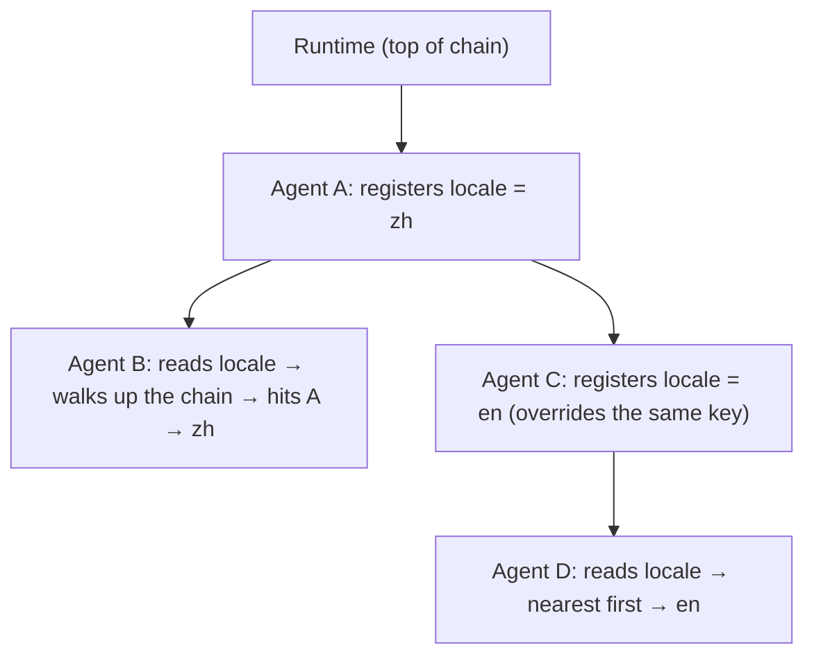

# 3-1 · Cross-Layer Sharing: Dependency Injection, Scopes, and Sensitive Data

> Prerequisites: Flowing CLI is installed and `DEEPSEEK_API_KEY` is set in the environment. Every file needed to run the example is included below.
> English greeting: `uv run flowing repl . --locale en`; Chinese comparison: run `uv run flowing repl .` (default `zh`) in a separate fresh working directory.
> Boundary demo: `uv run python demo_boundary.py`. Run each command in a working directory containing the corresponding inline files.

> Prerequisites: Chapter 2-3 "Assembly and Parameterization"

## What this chapter covers

The mechanisms for sharing runtime values between components on multiple
layers (an agent and its subcomponents): the general concepts of
dependency injection and the scope chain, and the boundary between
ordinary values and sensitive data.

## Background

Components need access to values supplied by their environment:
configuration, the current user, the working directory, language
settings. Fetching global state directly inside a component
(environment-variable singletons, module-level constants) couples the
component to its environment: it cannot be tested in isolation, and
multiple configurations cannot run in the same process.

Dependency injection is the standard solution: a component declares what
it needs, and the assembly side supplies it at construction time. What
is special in agent systems is that components form a hierarchy — which
values a subcomponent can access, and in what order they are searched,
requires a set of scoping rules.

## Core concepts

### Value registration and upward lookup

The general solution for hierarchical systems: every node may register
key-value pairs, and lookup starts at the current node and walks up the
parent chain; the first hit wins, and a miss at the top of the chain
raises an error.



Key rules:

- **Nearest first**: a registration on a lower level shadows the upper
  level; local configuration wins — the same rule as the scope chain in
  programming languages;
- **Live lookup**: every read walks the chain again, so the registrar
  can override the value at any time — switching configuration
  (language, mode) at runtime is therefore a routine operation;
- **A miss is an error**: not finding a key is an assembly error and
  raises an explicit error rather than returning an empty value.

The following pseudocode illustrates the lookup relationship only; the
`parent` and `child` names stand for component instances.

```python
# Conceptual shape: the registrar and the consumer hold no reference to each other
parent.provide("workspace", "workspace-root") # registered at assembly time
value = child.inject("workspace")            # resolved via upward lookup at use time
```

### Complete example materials

Each block heading gives the relative filename to create, and every block
contains the full file contents. Use two fresh working directories for the
locale comparison so that persisted session parameters do not affect the
second run. The provider credential is read from `DEEPSEEK_API_KEY`.

#### `root.fya`

```yaml
description: "Orchestrator: provides locale and dispatches greeting tasks to the greeter."
model_tag: default
args:
  locale:
    type: string
    default: zh
tools:
  - subagent-invoke
subagents:
  - ./agents/greeter
---
$system_prompt:
You are the orchestrator. When a greeting request arrives, call
subagent-invoke to dispatch it to the greeter (agent_type "greeter", pass no
parameters), and answer the user with its greeting.
---
$script:
async def setup(self, locale: str = "zh"):
    self.locale = locale
    self.provide("locale", locale)
```

#### `agents/greeter/agent.fya`

```yaml
description: "Greeter: greets the user in the language of the locale provided up the chain."
model_tag: default
---
$system_prompt:
You are the greeter. locale = {{ locale }}.
Greet the user in Chinese.Greet the user in English.
Output only the greeting itself.
---
$script:
async def setup(self):
    self.locale = self.inject("locale")
```

#### `main.py`

```python
from flowing import Runtime


async def main(user_name: str | None = None, locale: str = "zh",
               resume: str | None = None) -> Runtime:
    runtime = Runtime(persist_dir="@/.flowing")
    # runtime.set_providers("@/providers.yaml")
    # runtime.set_models("@/models.yaml")
    runtime.set_model_tags("@/model-tags.yaml")
    runtime.provide("timezone", "Asia/Shanghai")
    if resume is not None:
        await runtime.recover_agent(resume)
    else:
        kwargs: dict = {}
        if user_name is not None:
            kwargs["user_name"] = user_name
        if locale != "zh":
            kwargs["locale"] = locale
        await runtime.mount("@/root.fya", agent_id="agent-main", **kwargs)
    return runtime
```

#### `providers.yaml`

```yaml
deepseek:
  adapter: deepseek
  base_url: https://api.deepseek.com
  api_key: "{{env.DEEPSEEK_API_KEY}}"
```

#### `models.yaml`

```yaml
deepseek-flash:
  provider: deepseek
  model: deepseek-v4-flash
```

#### `model-tags.yaml`

```yaml
tags:
  default: deepseek-flash
```

#### Conversation with the English locale

Run `uv run flowing repl . --locale en` in a working directory containing
the files above, then enter the request and `/exit`:

```console
(agent-main)>>> Please send the greeter to greet me.
[thinking] (reasoning trace omitted)
[tool_call] subagent-invoke {"agent_type": "greeter", "prompt": "Greet the user."}
[tool:completed] subagent-invoke ->
Hello!
(agent-main)>>> /exit
```

#### Conversation with the default Chinese locale

Run `uv run flowing repl .` in another fresh working directory, then enter
the same request:

```console
(agent-main)>>> Please send the greeter to greet me.
[thinking] (reasoning trace omitted)
[tool_call] subagent-invoke {"agent_type": "greeter", "prompt": "Greet the user."}
[tool:completed] subagent-invoke ->
你好！
(agent-main)>>> /exit
```

#### `demo_boundary.py`

```python
import asyncio

from flowing import launch
from flowing.errors import MissingProvideError


async def main() -> None:
    runtime = await launch(".")
    agent = await runtime.get_agent("agent-main")
    try:
        agent.inject("no_such_key")
    except MissingProvideError as exc:
        print(f"inject miss → MissingProvideError: {exc}")
    await runtime.shutdown()


asyncio.run(main())
```

Run `uv run python demo_boundary.py`. Its output is:

```text
inject miss → MissingProvideError: Missing provide value for key: 'no_such_key'
```

The two interactions above show the locale comparison. The greeter is a new instance
created on each invocation, and its language parameter is not passed in
by the caller — the root agent registered `locale` on the shared chain
during assembly, and the greeter picked it up by walking up its parent
chain when it was created. When the registrar switches the value (en to
zh), the subcomponent's behavior switches with it, and neither side's
code changes.

### The boundary for sensitive data

Values in the shared channel fall into two classes with different
boundaries:

- **Ordinary runtime values** (working directory, language, theme): they
  may go into logs and may be displayed;
- **Sensitive values** (credentials, user identity): they must not enter
  the conversation context, must not be persisted, and must not appear
  in observability output.

The injection channel naturally suits sensitive values: it does not
enter the message flow or the model context. But "visible to all
descendants along the chain" means the visibility scope grows with the
hierarchy — credentials should be registered at the deepest node that
needs them, narrowing visibility to the subtree that actually needs it.
Heavy resources that need wider sharing (connection pools, clients) are
not the responsibility of the injection channel; they should be shared
by direct reference.

The miss-is-error boundary can be observed directly by running the complete
program above; its full output is included with the code.

Looking up a key that does not exist yields an explicit exception
instead of an empty value — an assembly error surfaces at the first
moment instead of remaining an "empty configuration" until late in the
run.

### Templates working with injection

When a runtime value is to be consumed by a prompt, an explicit fetch
step is required: inject it into an instance attribute first, then let
the template reference that attribute. Templates do not read the
injection chain directly — fetch time and render time are separated,
keeping the data flow auditable. In this chapter's example, the greeter's
`{{ locale }}` works exactly this way: its `setup()` stores the injected
value in an instance attribute first, and the prompt template then
references that attribute.

## Common misconceptions

1. **Sharing via module-level global variables.** Multiple
   configurations in one process pollute each other, and visibility
   cannot be narrowed per subtree;
2. **Registering credentials at the root node.** They become visible to
   the whole tree along the chain; register them at the deepest common
   node of the subtree that needs them;
3. **Injected values going straight into templates.** Route them through
   an instance attribute so the fetch point stays explicit.

## Exercises

1. Design a three-layer structure (application → session → task agent)
   and mark, for each of the three values locale, database connection,
   and current user, where it should be registered and which channel it
   should use;
2. Explain why live lookup makes switching the language at runtime
   possible, and what would be lost if the value were snapshotted at
   construction time instead;
3. Change the default of the `locale` parameter in the complete root-agent
   declaration above from `zh` to `en`, rerun the conversation without passing
   the argument, observe how the greeting language changes, and write
   down the complete path this value takes from startup to the prompt.

## Summary

1. Hierarchical systems share runtime values via "registration + upward
   lookup"; the rules are nearest first, live lookup, and a miss is an
   error;
2. Sensitive values go through the injection channel (not into context,
   not persisted) and are registered at deep nodes to narrow visibility;
   heavy resources are shared by direct reference;
3. Templates consume injected values only through an explicit fetch
   step, keeping the data flow auditable.
