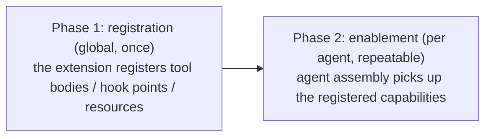

# 3-3 · Extension Architecture: the Plugin Model and Policy Composition

> Prerequisites: Flowing CLI is installed. This demo makes no model calls and requires no real credentials; every file needed to run it is included below.
> Run `uv run python demo_extensions.py` in a fresh isolated working directory containing the relative files below. Use a new working directory for each run.

> Prerequisites: Chapter 2-4 "Interception Points"

## What this chapter covers

Two forms of extending a system's capabilities: plugins (capability packages
with extension points) and policy composition (application logic injected
through Composable functions), plus designs such as two-phase enablement and
unloadable handlers.

## Background

Extensibility is a shared property of mature systems: the core stays stable
while capabilities enter through extensions. The plugin model has a long
history (browser extensions, editor plugins, server-side middleware
ecosystems) and has settled on a few stable design conclusions, which agent
frameworks adopt directly.

## Core concepts

### Extension point design

The foundation of the plugin mechanism is the **extension point**: a location
reserved in the core execution pipeline where an extension can step in
(conceptually the interception points of Chapter 2-4; the difference is that
an extension point also carries a contract — what data the extension receives
and what behavior it can affect). Criteria for designing an extension point:

- The data surface exposed by an extension point must be narrow: give only
  the necessary data, and never hand out a mutable reference to an internal
  object;
- Declaration and consumption are separated: the core declares, and
  extensions consume;
- An extension point costs nothing while unused: an extension point existing
  does not imply a cost, and an empty extension point must behave exactly
  like no extension point.

### Two-phase enablement

Systems with extension capabilities commonly adopt two-phase enablement:



The reason for two phases: registration is global and happens once, while
enablement is per agent and may happen many times. Merging them would make
"installed" indistinguishable from "in use" — an agent that never enabled an
extension would still carry the extension's overhead and risk. With the
phases separated, "not enabled" is equivalent to "not present".

### Complete example materials

Each block heading gives the relative filename to create, and every block
contains the full file contents. The demo script makes no model calls. The
`quick-tip` skill is included to show catalog injection; its complete
definition is inline here.

#### `root.fya`

```yaml
description: "Extension example assistant: skill-load + echo tool + policy injection demo."
model_tag: default
tools:
  - skill-load
  - ./tools/echo.py
skills:
  - ./skills/quick-tip.md
---
$system_prompt:
You are a demo assistant. Use skill-load when the user wants to load a skill. Keep answers to one sentence.
---
$script:
from flowing.plugins.skills import use_skill


async def setup(self):
    use_skill(self)
```

#### `skills/quick-tip.md`

```markdown
---
name: quick-tip
description: Give one brief, practical suggestion for the current situation.
---

## Instructions

Use the caller's task to produce one specific, concise, actionable suggestion.
Output only the suggestion itself.
```

#### `main.py`

```python
from flowing import Runtime
from flowing.plugins.skills import SkillPlugin


async def main(resume: str | None = None) -> Runtime:
    runtime = Runtime(persist_dir="@/.flowing")
    # runtime.set_providers("@/providers.yaml")
    # runtime.set_models("@/models.yaml")
    runtime.set_model_tags("@/model-tags.yaml")
    runtime.install(SkillPlugin())
    if resume is not None:
        await runtime.recover_agent(resume)
    else:
        await runtime.mount("@/root.fya", agent_id="agent-main")
    return runtime
```

#### `late-main.py`

```python
from flowing import Runtime


async def main() -> Runtime:
    runtime = Runtime(persist_dir="@/.flowing-late")
    # runtime.set_providers("@/providers.yaml")
    # runtime.set_models("@/models.yaml")
    runtime.set_model_tags("@/model-tags.yaml")
    # Deliberately omit SkillPlugin: setup() cannot obtain its registry.
    await runtime.mount("@/root.fya", agent_id="agent-main")
    return runtime
```

#### `providers.yaml`

```yaml
deepseek:
  adapter: deepseek
  base_url: https://api.deepseek.com
  api_key: "{{env.DEEPSEEK_API_KEY}}"
```

#### `models.yaml`

```yaml
deepseek-flash:
  provider: deepseek
  model: deepseek-v4-flash
```

#### `model-tags.yaml`

```yaml
tags:
  default: deepseek-flash
```

#### `tools/echo.py`

```python
from pydantic import BaseModel

from flowing import ScriptTool


class EchoArgs(BaseModel):
    text: str


class EchoTool(ScriptTool):
    """Return the input text unchanged."""

    name = "echo"
    args_model = EchoArgs

    async def execute(self, *, text: str) -> str:
        return text
```

#### `composables/rate_limit.py`

```python
import asyncio

from flowing.errors import Intercepted


def use_rate_limit(agent, *, max_calls: int = 5, window_seconds: float = 60.0) -> None:
    agent.hooks.declare("on_rate_limited", by="rate-limit", match_on="name")
    calls: list[float] = []

    async def _gate(agent_, tool_call):
        now = asyncio.get_event_loop().time()
        calls[:] = [t for t in calls if now - t < window_seconds]
        if len(calls) >= max_calls:
            await agent_.hooks.on_rate_limited.dispatch(agent_, tool_call)
            raise Intercepted(
                f"Rate limit exceeded: {max_calls} calls / {window_seconds:.0f} seconds,"
                " please try again later")
        calls.append(now)
        return tool_call

    agent.hooks.before_tool_call(_gate, by="rate-limit", tags=["rate-limit"])


def remove_rate_limit(agent) -> int:
    return agent.hooks.before_tool_call.remove_by_owner("rate-limit")
```

#### `demo_extensions.py`

```python
import asyncio
import sys

from flowing import Runtime, launch
from flowing.errors import DependencyError, MissingProvideError, ToolNotFoundError
from flowing.plugins import Plugin
from flowing.tool import ToolCall

sys.path.insert(0, "composables")
from rate_limit import remove_rate_limit, use_rate_limit


class _P1(Plugin):
    name = "p1"
    dependencies = ("p2",)

    def install(self, runtime):
        pass


class _P2(Plugin):
    name = "p2"
    dependencies = ("p1",)

    def install(self, runtime):
        pass


async def main() -> None:
    runtime = await launch(".")
    agent = await runtime.get_agent("agent-main")

    print("== (1) Products of two-phase enablement ==")
    print(f"   skill-load in the global registry: {agent.get_tool('skill-load') is not None}")
    print(f"   prompt block contains skills catalog: "
          f"{any(b.name == 'skills' for b in agent.prompt_blocks)}")

    print("== (2) Late install (install after mount) -> creation-time failure ==")
    try:
        await launch(".", main_file="@/late-main.py")
        print("   Unexpected success (contract violation)")
    except (ToolNotFoundError, MissingProvideError) as exc:
        print(f"   late-install launch failed: {type(exc).__name__} "
              "(the plugin's registered tool bodies belong to phase 1; "
              "install must precede the first mount)")

    print("== (3) Dependency declaration: cycles fail fast ==")
    try:
        runtime.install(_P1(), _P2())
    except DependencyError:
        print("   p1 <-> p2 depend on each other -> DependencyError")

    print("== (4) use_rate_limit(max_calls=3) injection ==")
    limited: list[str] = []
    use_rate_limit(agent, max_calls=3, window_seconds=60.0)

    async def observe(agent_, tool_call):
        limited.append(tool_call.name)
        return tool_call
    agent.hooks.on_rate_limited(observe, by="demo")

    results = []
    for i in range(5):
        result = await agent.tool_call(ToolCall(
            id=f"c{i}", name="echo", args={"text": f"call {i}"}))
        results.append(result.status)
    print(f"   5 call results: {results}")
    print(f"   on_rate_limited observed {len(limited)} blocked calls (calls 4 and 5)")

    print("== (5) remove_by_owner removes the whole group ==")
    removed = remove_rate_limit(agent)
    result = await agent.tool_call(
        ToolCall(id="c9", name="echo", args={"text": "resume"}))
    print(f"   removed {removed} handler(s); one more call: status={result.status}")
    await runtime.shutdown()


asyncio.run(main())
```

Run `uv run python demo_extensions.py`. Its deterministic output is shown in
the following blocks:

```console
== (1) Products of two-phase enablement ==
   skill-load in the global registry: True
   prompt block contains skills catalog: True
== (2) Late install (install after mount) -> creation-time failure ==
   late-install launch failed: ToolNotFoundError (the plugin's registered tool bodies belong to phase 1; install must precede the first mount)
== (3) Dependency declaration: cycles fail fast ==
   p1 <-> p2 depend on each other -> DependencyError
```

Walk through the segments one by one: segment (1) shows the two products of
the normal path — phase 1 registered the skill-loading tool into the global
registry, and phase 2 made a skills catalog appear in the agent's prompt;
segment (2) is a deliberately inverted negative example — the agent is
created before the plugin is registered, so creation fails outright (the
registry it wants to consume does not exist yet): "late install is invalid"
is a creation-time error, not a runtime surprise; segment (3) shows two
plugins that declare dependencies on each other failing with a cycle error
at the registration site — dependencies are only declared, never solved
automatically, and a cycle fails immediately. The late-install negative
example writes into a separate state directory and can leave a partial
session before raising. Use a fresh isolated working directory for every
run of the demo script; do not rerun it in a directory that already
contains state, and no manual cleanup is needed.

### Policies compose; handlers can be unloaded

Behavior policies (retry, rate limiting, reminder injection) can be injected
through Composable functions. The rate-limit example below implements its
policy by registering a handler at an interception point; a Composable's
function body may also attach Agent attributes, register state, or perform
other application-layer logic. Transient state may live in a closure or an
Agent attribute. Keeping state in a closure created by that call avoids
collisions with Agent attribute names, but external code cannot access it
through the Agent; Agent attributes are
externally accessible and manageable, but their names must avoid collisions.
State that must persist can use Flowing's built-in `agent.state.register()` or
application-managed persistence and recovery; closure variables and ordinary
Agent attributes do not provide persistence by themselves.

The following pseudocode illustrates the shape only. Its helper names are
placeholders; the complete runnable rate-limit implementation appears in
the example materials above.

```python
# Conceptual shape of policy injection
def use_rate_limit(component, *, max=5, window=60):
    calls = []
    def gate(call):                        # the policy body = one interception handler
        prune_old(calls, window)
        if len(calls) >= max:
            raise Blocked("rate limit exceeded")
        calls.append(now())
        return call
    component.on_before_call(gate, owner="rate-limit")   # attach under a group name
```

This example shows three composition choices:

- **Composable**: multiple policies each attach to their own points without
  awareness of one another; the composition order is the registration order;
- **Unloadable handlers**: group handlers by name when they need to be removed
  together with `remove_by_owner`; this does not restrict other Composable
  behavior;
- **No automatic call deduplication**: the same Composable can be called with
  different parameters. The framework does not deduplicate calls, and the
  Composable implementation determines their effect; this example's handlers
  stack according to registration semantics.

Output segments (4) and (5) show this pattern in action; its complete
implementation is included above:

```console
== (4) use_rate_limit(max_calls=3) injection ==
   5 call results: ['completed', 'completed', 'completed', 'blocked', 'blocked']
   on_rate_limited observed 2 blocked calls (calls 4 and 5)
== (5) remove_by_owner removes the whole group ==
   removed 1 handler(s); one more call: status=completed
```

Line by line: after injecting a rate limit of "at most 3 calls within 60
seconds", five calls fire in a row — the first 3 are allowed (completed) and
calls 4 and 5 are blocked, and each block also triggers one observation
notification; once the whole group is removed, one more call is allowed
immediately. The policy explicitly adds and removes handlers in the agent's
hook registry; it does not require changing the agent's core implementation.

## Common misconceptions

1. **Registration equals enablement**. The point of the two phases is exactly
   to separate the two; conflating them makes it impossible to answer "which
   capabilities does this agent currently have";
2. **Handlers that need bulk removal are not grouped**. Give handlers a group
   name when you need to remove them together;
3. **Extension points expose mutable internal objects**. A narrow data
   surface is a prerequisite for long-term stability.

## Exercises

1. List three extension points of an editor or browser you know, order them
   by the width of the data surface they expose, and explain why the widest
   one is dangerous;
2. Implement an "inject one reminder per turn" policy in pseudocode (hook
   point + group name + an unload function), and check it against the
   pattern in this chapter to see whether all three design conclusions hold;
3. Modify the complete demo script above to inject the rate limit policy twice (call
   `use_rate_limit` twice), run it, and infer the actual semantics of
   "stacked registration" from the call results.

## Summary

1. The foundation of the plugin mechanism is the extension point: a
   location, a narrow data surface, declaration separated from consumption,
   and zero overhead when empty;
2. Two-phase enablement separates "installed" from "in use";
3. Composable functions inject application logic; handlers can be grouped as
   needed, and calls are not automatically deduplicated;
4. These three design conclusions recur across mature ecosystems, and agent
   frameworks adopt them directly.
