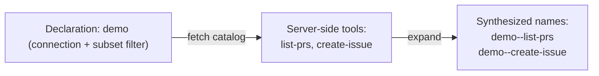

# 4-1 · Protocol-based Tool Access: MCP and Transport Trade-offs

> Prerequisites: Flowing CLI and the MCP Python SDK are installed, and `DEEPSEEK_API_KEY` is set in the environment. Every file needed to run the example is included below.
> Conversation: `uv run flowing repl .`; credential-boundary demo: `uv run python demo_env_failfast.py`. Run the commands in the working directory containing the corresponding inline files.

> Prerequisites: Chapter 1-2 "Tool Calling"

## What this chapter covers

This chapter covers the protocolization of tool sourcing: how a tool
catalog is described and discovered across process boundaries when tools
are provided by a third party rather than written by you. It uses MCP as
the example to explain the structure of protocol-based access and the
transport trade-offs.

## Background

The tool-call convention of Chapter 1-2 solves tool description between
the model and the framework; but the tools themselves are often provided
by another process — a database tool, a SaaS plugin, an internal service
written by a colleague. Supplying tools across process boundaries needs
one more protocol layer: it fixes how the tool catalog is fetched, how
invocations are transported, and how credentials are passed.

MCP (Model Context Protocol) is the industry protocol at this layer: the
server side exposes a tool catalog and invocation endpoints, and the
client (the agent framework) builds its own tool representation from
that catalog. The value of the protocol is decoupling: a tool author
implements an MCP service once and it can be used by any compatible
framework; the framework side integrates against the protocol and no
longer needs a dedicated adapter per tool.

## Core concepts

### Group proxy: one declaration brings in a whole tool group

The object of protocol-based access is usually not a single tool but a
group of tools (one MCP service exports several tools). The declaration
is therefore in the form of a **group proxy**: you declare the
connection, and the framework fetches the catalog and expands it into
actual tools under synthesized names.



The synthesized name provides namespace isolation: different services
may export tools with the same name (two services both have `search`),
and prefixing the declaration name joined with a double hyphen makes
them globally unique. On the agent side, referencing a synthesized name
is equivalent to addressing by "service.tool".

### Complete example materials

Each block heading gives the relative filename to create, and each block
contains the full file contents. The stdio subprocess starts automatically
from the tool declaration. The model credential is read from the
`DEEPSEEK_API_KEY` environment variable.

#### `root.fya`

```yaml
description: "MCP demo assistant: check PRs and create Issues via the demo tool group."
model_tag: default
tools:
  - ./tools/demo
---
$system_prompt:
You are a demo assistant. When the user asks for the list of PRs, use
demo--list-prs; when the user asks to create an Issue, use
demo--create-issue. Keep the answer to one sentence.
```

#### `tools/demo/TOOL.fya`

```yaml
name: demo
type: mcp
description: A GitHub-style demo tool group.
command: uv
args: ["run", "python", "tools/demo_server.py"]
tools: [list-prs, create-issue]
```

#### `tools/demo_server.py`

```python
from __future__ import annotations

import sys

from mcp.server.mcpserver import MCPServer

port = int(sys.argv[2]) if len(sys.argv) > 2 else 0
mcp = MCPServer("demo-github")


@mcp.tool(name="create-issue")
def create_issue(title: str, body: str = "") -> dict:
    """Create a GitHub issue."""
    return {"issue_id": 42, "title": title, "body": body,
            "url": "https://example.test/issues/42"}


@mcp.tool(name="list-prs")
def list_prs(state: str = "open") -> list[dict]:
    """List pull requests."""
    return [{"number": 1, "title": "fix typo", "state": state},
            {"number": 2, "title": "add feature", "state": state}]


if __name__ == "__main__":
    mode = sys.argv[1] if len(sys.argv) > 1 else "stdio"
    transport = {"http": "streamable-http"}.get(mode, mode)
    if transport == "stdio":
        mcp.run(transport="stdio")
    else:
        mcp.run(transport=transport, host="127.0.0.1", port=port)
```

#### `main.py`

```python
from flowing import Runtime


async def main(user_name: str | None = None, locale: str = "zh",
               resume: str | None = None) -> Runtime:
    runtime = Runtime(persist_dir="@/.flowing")
    # runtime.set_providers("@/providers.yaml")
    # runtime.set_models("@/models.yaml")
    runtime.set_model_tags("@/model-tags.yaml")
    runtime.provide("timezone", "Asia/Shanghai")
    if resume is not None:
        await runtime.recover_agent(resume)
    else:
        kwargs: dict = {}
        if user_name is not None:
            kwargs["user_name"] = user_name
        if locale != "zh":
            kwargs["locale"] = locale
        await runtime.mount("@/root.fya", agent_id="agent-main", **kwargs)
    return runtime
```

#### `providers.yaml`

```yaml
deepseek:
  adapter: deepseek
  base_url: https://api.deepseek.com
  api_key: "{{env.DEEPSEEK_API_KEY}}"
```

#### `models.yaml`

```yaml
deepseek-flash:
  provider: deepseek
  model: deepseek-v4-flash
```

#### `model-tags.yaml`

```yaml
tags:
  default: deepseek-flash
```

#### Conversation input and visible output

Run `uv run flowing repl .` in the working directory containing these
files, then enter:

```text
Which PRs are open right now? Then create an Issue titled "Demo Issue" for me.
/exit
```

The visible interaction is shown below. Tool completion order can vary;
`[thinking]` is only an omission placeholder:

```console
(agent-main)>>> Which PRs are open right now? Then create an Issue titled "Demo Issue" for me.
[thinking] (reasoning trace omitted)
[tool_call] demo--list-prs {"state": "open"}
[tool_call] demo--create-issue {"title": "Demo Issue"}
[tool:completed] demo--create-issue -> {
  "issue_id": 42,
  "title": "Demo Issue",
  "body": "",
  "url": "https://example.test/issues/42"
}
[tool:completed] demo--list-prs ->
The open PRs are #1 "fix typo" and #2 "add feature", and I've created Issue #42 titled "Demo Issue" (https://example.test/issues/42).
(agent-main)>>> /exit
```

Line by line: both `[tool_call]` lines use synthesized names (the
`demo--` prefix plus the server-side tool name), and the agent called
them in parallel just like ordinary tools, with fully visible arguments
(`demo--list-prs` carried the query parameter `state`, and
`demo--create-issue` carried `title`); the receipt with the JSON body is
the structured data returned by the server (`issue_id: 42`), and it
entered the final answer. For the agent, tools accessed through a
protocol feel exactly the same as local tools — the difference lies only
in declaration and assembly.

### Transport forms: stdio and remote

The trade-offs between the two connection forms:

| Dimension | stdio (local subprocess) | Remote (HTTP/SSE) |
|---|---|---|
| Deployment | Distributed with the project; spawned on startup | Standalone service shared by multiple clients |
| Credentials | Passed via the subprocess environment; never leave the machine | Passed via request headers; travel over the network |
| Trust boundary | The machine's trust domain | The network trust domain; authentication and transport security must be considered |
| Suitable for | Local tools, development, single user | Shared services, production deployment, multi-tenant |

The selection criterion is the trust and operations boundary: local
script tools go over stdio, while capability services shared by a team
go over a remote endpoint. This chapter's example uses stdio — when the
conversation runs, no service is started manually; the subprocess is
spawned automatically by the declaration.

### Credential validation at assembly time

Protocol-based declarations often embed credential references
(environment-variable templates). A missing credential should raise an
error **at declaration assembly time** rather than failing on the first
call — the same principle as the creation-time validation in chapter
2-3, differing only in where it happens: the declaration loading site.

The following complete program loads a declaration that references a
nonexistent environment variable.

#### `demo_env_failfast.py`

```python
import asyncio
import pathlib
import tempfile

from flowing.errors import FormatError
from flowing.tool.registry import ToolRegistry

BOGUS = """name: bogus
type: mcp
description: A declaration whose credential template is missing.
command: python
args: ["server.py"]
env:
  API_KEY: "{{ env.NO_SUCH_VAR }}"
"""


async def main() -> None:
    temporary = pathlib.Path(tempfile.mkdtemp())
    (temporary / "bogus").mkdir()
    (temporary / "bogus" / "TOOL.fya").write_text(BOGUS, encoding="utf-8")
    registry = ToolRegistry(project_root=pathlib.Path.cwd())
    try:
        registry.get("./bogus", source_dir=temporary)
    except FormatError as exc:
        print(f"Missing credentials fail fast at assembly time → FormatError: {exc}")


asyncio.run(main())
```

Run `uv run python demo_env_failfast.py`. Its complete output is:

```text
Missing credentials fail fast at assembly time → FormatError: environment variable referenced by template '{{ env.NO_SUCH_VAR }}' is missing: 'mappingproxy object' has no attribute 'NO_SUCH_VAR'
```

This line is the assembly-time check in action: the format error is
raised during declaration loading, so the process never reaches the
first real call before the missing credential is discovered.

## Common misconceptions

1. **Designing protocol-based access around single tools.** The unit of
   protocol-based access is the service (a group of tools); single-tool
   thinking leads to one connection per tool;
2. **Ignoring the namespace.** Tools with the same name across services
   must be distinguishable, and synthesized names are the default
   answer;
3. **Discovering missing credentials at call time.** Validation happens
   at assembly time, and the failure must occur before any call.

## Exercises

1. A team wants to integrate three MCP services (a local file service,
   a remote search service, and a remote database service). Choose a
   transport form for each and justify the choice;
2. Draw the expansion sequence of the group proxy: declaration →
   catalog fetch → synthesized-name registration → the agent calling by
   synthesized name;
3. Modify the inline tool-group declaration above to shrink the
   `tools:` subset down to `list-prs` only, rerun the conversation, and
   observe how the agent responds to the "create an Issue" request.

## Summary

1. Protocol-based access solves cross-process tool supply, and MCP is its industry form;
2. The declaration is a group proxy, expanded under synthesized names for namespace isolation;
3. The choice between stdio and remote follows the trust and operations boundary;
4. Credentials are validated at assembly time: report a missing credential as early as possible.
