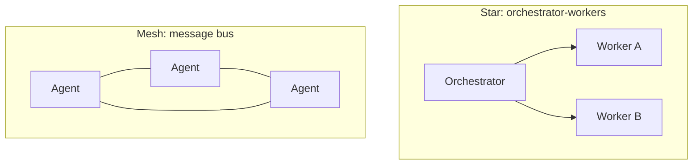

# 5-2 · Organization Patterns: The Full Picture

> Self-contained example: the complete configuration, agents, tool, target-project data, input, and representative output appear below. Create the relative files, then run `uv run flowing repl . --cwd target` from the current directory; the parallel demo runs with `uv run python demo_fanout.py`.
> The conversation example requires the `DEEPSEEK_API_KEY` environment variable. Do not put a real credential in a file.

> Prerequisites: Chapter 5-1 "Motivation for Splitting and Its Costs"

## What this chapter covers

The five organization patterns of multi-agent systems: their structures,
collaboration protocols, applicable scenarios, and the criteria for choosing
among them.

## Background

An organization pattern answers one question: among multiple agents, **who
decides who does what, and where do results flow**. Choosing among patterns
is isomorphic to choosing among software architecture patterns — there is no
optimum, only a match to the structure of the task.

## Core concepts

### The five patterns

| Pattern | Structure | Collaboration protocol | Fits when |
|---|---|---|---|
| Orchestrator-workers | One dispatcher plus several workers | The dispatcher dispatches → workers execute → results return to the dispatcher for rollup | Tasks decomposable; workers heterogeneous |
| Router | One front classifier plus fully specialized backends | The classifier forwards once and does not aggregate | Request types are discrete; backends do not collaborate |
| Hierarchical team | Tree: middle layers are both dispatched to and dispatch to others | Delegation and rollup level by level | Collaboration scale exceeds one span of control |
| Message bus | No center; agents send and receive by topic | Publish/subscribe; each side decides whether to respond | Collaboration with no clear dispatcher |
| Programmatic fan-out | Code creates homogeneous agents in parallel | Code waits for all of them to finish (gather) | Homogeneous batch tasks |



### Key dimensions of difference among the patterns

Choosing is really comparing three dimensions:

1. **Where the decision sits**: whether dispatch decisions are made by a
   model (orchestrator / router) or by code (programmatic fan-out). Model
   decisions are flexible but nondeterministic; code decisions are
   deterministic but not adaptive;
2. **What the middle layer does with results**: the orchestrator aggregates,
   the router does not touch them, and fan-out merges them in code;
3. **Topology**: star (central dispatch), tree (hierarchy), mesh (bus). The
   topology determines how hard consistency is to maintain.

This chapter compares orchestrator-workers with programmatic fan-out. First create the complete clean fixture listed below; the target project initially has no README. Run the command and enter:

**Input**

```text
First dispatch explore to inspect the target structure and report back. After receiving the report, use todo to break "write a README.md for this project" into a task list, then dispatch coder to write it and report the delivery.
/exit
```

**Representative flow output**

```text
(agent-main)>>> First dispatch explore to inspect the target structure and report back. After receiving the report, use todo to break "write a README.md for this project" into a task list, then dispatch coder to write it and report the delivery.
[thinking] (reasoning trace omitted)
[tool_call] subagent-invoke {"agent_type":"explore-agent","name":"explore-target","prompt":"Read-only inspection of target: list its tree and identify Python files, notes, configuration, and tests. Do not modify anything."}
[tool:completed] subagent-invoke ->
target contains pkg/calc.py and two Markdown notes defining the adder and divider terms. It is a standard-library-only calculator project with no README, dependency manifest, or tests initially.
[thinking] (reasoning trace omitted)
[tool_call] todo {"tasks_text":"1. Summarize the target structure and function behavior\n2. Plan README sections for overview, structure, usage, API, terms, and conventions\n3. Write the README\n4. Check the README against the function behavior\n5. Report the delivery"}
[tool:completed] todo ->
Task list created: 5 items.
[thinking] (reasoning trace omitted)
[tool_call] subagent-invoke {"agent_type":"coder","name":"readme-writer","prompt":"Using the target data reproduced in full in this chapter, write a README.md for the project. Document add and div signatures, behavior, and the division-by-zero exception. Do not claim unsupported features. Report changed files and self-check results when done."}
[tool:completed] subagent-invoke ->
The README was created and self-checked; its structure, commands, and API descriptions match the supplied data.
(agent-main)>>>
```

The exact README wording is model-generated and may vary. The checkable results are the dispatch order, the task list, and delivery of a README in the specified working directory.

The following is a complete representative README output. The model's wording may vary; this version describes only the function and terminology data reproduced on this page.

**Representative generated result: `target/README.md`**

````markdown
# Calculator Project

A small calculator example that uses the Python standard library and provides addition and division functions.

## Project structure

```text
pkg/calc.py
notes/adder.md
notes/divider.md
```

## API

### `add(a: float, b: float) -> float`

Return the sum of `a` and `b`.

### `div(a: float, b: float) -> float`

Return the quotient of `a` divided by `b`. Raise `ValueError` when `b` is zero.

## Usage

```python
from pkg.calc import add, div

print(add(2, 3))  # 5
print(div(6, 4))  # 1.5
```

## Terms

- `adder` refers to the addition operation `add(a, b)`.
- `divider` refers to the division operation `div(a, b)`.

## Conventions

Function parameters and return values are annotated as `float`. The project uses the Python standard library and declares no additional dependencies.

The project has no test suite or command-line entry point.
````

This is **orchestrator-workers**: the decisions of whom to dispatch and in
what order are made by the orchestrator's model (it judges that exploration
is a prerequisite for a good task list, dispatches explore first, and builds
the list only after the report comes back), and the results all return to
the orchestrator, which rolls them up into one report.

Also run `uv run python demo_fanout.py`:

```console
coder-a: status=completed
coder-b: status=completed
```

This is **programmatic fan-out**: the script directly creates two homogeneous
coder instances and has them write two term notes in parallel; neither
dispatch nor merging goes through the model — the decision location moved
from the model into code. The two demonstrations differ only in what drives
them.

### Complete example materials

The following are all application files and the minimal target data required by both demonstrations. Create them at the relative filenames shown. The target project starts without a README. `explore-agent` is Flowing's built-in read-only subagent.

```console
export DEEPSEEK_API_KEY=sk-your-key-here
```

**`providers.yaml`**

```yaml
deepseek:
  adapter: deepseek
  base_url: https://api.deepseek.com
  api_key: "{{env.DEEPSEEK_API_KEY}}"
```

**`models.yaml`**

```yaml
deepseek-flash:
  provider: deepseek
  model: deepseek-v4-flash
```

**`model-tags.yaml`**

```yaml
tags:
  default: deepseek-flash
```

**`main.py`**

```python
from flowing import Runtime


async def main(cwd: str | None = None) -> Runtime:
    runtime = Runtime(persist_dir="@/.flowing")
    # runtime.set_providers("@/providers.yaml")
    # runtime.set_models("@/models.yaml")
    runtime.set_model_tags("@/model-tags.yaml")
    if cwd:
        runtime.provide("cwd", cwd)
    await runtime.mount("@/root.fya", agent_id="agent-main")
    return runtime
```

**`root.fya`**

```yaml
description: "Programming-task orchestrator: inspect structure, break down work, and delegate implementation."
model_tag: default
tools:
  - subagent-invoke
  - ./tools/todo.py
subagents:
  - builtin::explore-agent
  - ./agents/coder
---
$system_prompt:
You are a programming-task orchestrator. Working directory: {{ cwd }}.
First dispatch explore-agent for a read-only inspection, then use todo to split
implementation work into a list, and finally dispatch coding to coder.
Do not read or write target-project files yourself. Include the target path and
necessary context in every delegation. Report only work that was actually delivered.
---
$script:
async def setup(self):
    self.cwd = self.inject("cwd")
```

**`agents/coder/agent.fya`**

```yaml
description: "Programming agent: reads and writes files in the assigned working directory and delivers the result."
model_tag: default
tools:
  - read
  - write
  - edit
  - grep
  - glob
  - bash
  - finish
---
$system_prompt:
You are a programming agent. Working directory: {{ cwd }}. Read and write files
only in that directory; never guess a path. When finished, call finish with a
summary of the work and the relative filenames actually changed.
---
$script:
async def setup(self):
    self.cwd = self.inject("cwd")
```

**`tools/todo.py`**

```python
from pydantic import BaseModel, Field
from flowing import ScriptTool


class TodoArgs(BaseModel):
    tasks_text: str = Field(description="One task per line; a line starting with [x] is complete")


class TodoTool(ScriptTool):
    name = "todo"
    args_model = TodoArgs

    async def execute(self, *, tasks_text: str) -> dict:
        items = []
        for raw in tasks_text.splitlines():
            line = raw.strip()
            if not line:
                continue
            done = line[:3].lower() == "[x]"
            title = (line[3:] if done else line).strip().lstrip("-•").strip()
            if not title:
                raise ValueError(f"Task line is empty: {raw!r}")
            items.append({"title": title, "done": done})
        if not items:
            raise ValueError("Task list is empty: provide at least one task")
        return {
            "total": len(items),
            "open": sum(1 for item in items if not item["done"]),
            "items": items,
        }
```

**`target/pkg/calc.py`**

```python
"""Example project: calculator."""


def add(a: float, b: float) -> float:
    return a + b


def div(a: float, b: float) -> float:
    if b == 0:
        raise ValueError("divisor must not be 0")
    return a / b
```

**`target/notes/adder.md`**

```markdown
The term adder refers to the calculator's addition operation, implemented by `add(a, b)` in `pkg/calc.py`.
```

**`target/notes/divider.md`**

```markdown
The term divider refers to the calculator's division operation, implemented by `div(a, b)` in `pkg/calc.py`.
```

**`demo_fanout.py`**

```python
import asyncio
from flowing import launch


async def main() -> None:
    runtime = await launch(".", cwd="target")
    root = await runtime.get_agent("agent-main")

    async def job(name: str, topic: str) -> str:
        child = await root.create_subagent("@/agents/coder", name=name)
        try:
            result = await child.query(
                f"Write a notes/{topic}.md in the working directory with one sentence "
                f"explaining the role of {topic} in this project. Create the directory "
                "if needed, then submit with finish."
            )
            return f"{name}: status={result.status}"
        finally:
            await child.destroy()

    results = await asyncio.gather(
        job("coder-a", "adder"), job("coder-b", "divider")
    )
    for line in results:
        print(line)
    await runtime.shutdown()


asyncio.run(main())
```

The programmatic demonstration prints `coder-a: status=completed` and `coder-b: status=completed`. The README body in the conversation example is generated by the model, so its exact wording varies; its structure, function behavior, and division-by-zero exception should match the inline data above.

### Combining is the norm

Real systems usually combine the patterns: a router at the entry classifies
request types, heavy tasks enter an orchestrator subtree, and batch subtasks
fan out inside a worker. Patterns are not mutually exclusive options; they
are building blocks.

## Common misconceptions

1. **Defaulting to an orchestrator.** Homogeneous batch tasks are simpler
   and cheaper with fan-out, and a problem a router can solve does not need
   a hierarchy;
2. **Starting from mesh collaboration.** A centerless topology has the
   highest consistency and debugging costs; start from a star and loosen it
   only when there is a real need;
3. **Mixing patterns without boundaries.** Combining is fine, but the
   decision location and the result-processing responsibility of every
   stage must be explicit.

## Exercises

1. For a "data reporting platform," choose a pattern for each of the three
   requirement types — scheduled reports, ad-hoc queries, and anomaly
   alerts — and state where the decision sits (model / code);
2. Draw the topology of three patterns (star / tree / mesh) and mark the
   "impact radius of a single failure" on each;
3. Read `demo_fanout.py` and `root.fya` of this chapter's example and point
   out, for each of the two patterns, the code location where the "task
   assignment" decision happens.

## Summary

1. Five patterns: orchestrator-workers, router, hierarchy, message bus,
   programmatic fan-out;
2. Dimensions of choice: decision location, middle-layer responsibility,
   topology;
3. Patterns are building blocks; real systems combine them, and when they
   do, the responsibility of every stage must be explicit.
