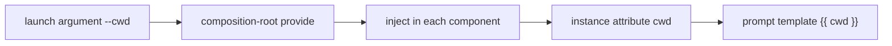

# 5-5 · Final Assembly: Composition Root, Orchestration Drive, and Configuration Injection Chain

> This page contains the files, complete inputs, and representative outputs needed for its example. Model-generated prose may vary; the output illustrates the control flow.
>
> Prerequisites: Chapter 5-3, “Orchestrator Design,” and Chapter 5-4, “Instance Lifecycle.” See [Appendix A](a-appendix-environment.md) for environment and credential setup.

## What this chapter covers

This chapter assembles the preceding concepts into a runnable system. It explains where the composition root belongs, compares two orchestration drives, traces runtime values through an injection chain, and provides a final-assembly checklist. The complete small project on this page has the orchestrator inspect a calculation module and plan a README task, delegate the writing to a coder, and then resume the named coder instance to review the result.

## Background

The final step in component-based design is to instantiate, connect, and configure all components at the application entry point. This location is the composition root: the single place where the entire object graph is assembled. An agent application must also choose its orchestration drive and define how runtime values flow through that graph.

## Core concepts

### Structure of the composition root

The `main.py` in this example is the composition root. It creates the runtime, loads model configuration, registers the runtime value `cwd`, and chooses whether to create or recover the root agent.

**`pyproject.toml`**

```toml
[project]
name = "flowing-5-5-practice"
version = "0.1.0"
requires-python = ">=3.13"
dependencies = ["flowing-agent>=0.1.0"]

[tool.uv]
package = false
```

**`providers.yaml`**

```yaml
deepseek:
  adapter: deepseek
  base_url: https://api.deepseek.com
  api_key: "{{env.DEEPSEEK_API_KEY}}"
```

**`models.yaml`**

```yaml
deepseek-flash:
  provider: deepseek
  model: deepseek-v4-flash
```

**`model-tags.yaml`**

```yaml
tags:
  default: deepseek-flash
```

**`main.py`**

```python
"""Composition root for the multi-agent application."""

from flowing import Runtime


async def main(cwd: str | None = None) -> Runtime:
    runtime = Runtime(persist_dir="@/.flowing")
    # runtime.set_providers("@/providers.yaml")
    # runtime.set_models("@/models.yaml")
    runtime.set_model_tags("@/model-tags.yaml")
    if cwd:
        runtime.provide("cwd", cwd)
    await runtime.mount("@/root.fya", agent_id="agent-main")
    return runtime
```

The composition root performs assembly only and contains no business logic. The idempotent mount with a fixed `agent_id` makes the second launch go through the recovery pipeline automatically, so the composition root does not need to distinguish a fresh start from a resumption.

### The two forms of orchestration drive

| | Model routing (orchestrator dispatch) | Programmatic drive (code fan-out) |
|---|---|---|
| Decision location | The model interprets the task | Code follows predetermined branches |
| Flexibility | High, because task descriptions can vary | Lower, because branches are encoded in advance |
| Auditability | Decisions are traced through the message record | Decisions are visible in code |
| Suitable for | Variable, heterogeneous task structures | Fixed, homogeneous batch tasks |

Choose based on task-structure stability. Code can drive stable parts and avoid unnecessary model routing; model routing can handle variable parts. A mixed design is common. The complete project on this page demonstrates model routing. Chapter 5-2 contains the complete programmatic fan-out example.

### Agents and tool in this example

The root agent can invoke subagents and call the `todo` checklist tool. It handles inspection, planning, and delegation, but does not read or write files itself. Only the coder receives file tools, and it must operate within the injected working directory.

**`root.fya`**

```yaml
description: "Programming-task orchestrator: inspect the project, plan tasks, and delegate implementation."
model_tag: default
tools:
  - subagent-invoke
  - ./tools/todo.py
subagents:
  - explore-agent
  - ./agents/coder
---
$system_prompt:
You are a programming-task orchestrator. Working directory: {{ cwd }}.
1. Ask explore-agent to inspect {{ cwd }} and report the code structure. Include the full working-directory value in the task prompt and keep the inspection read-only.
2. Use the todo tool to turn implementation requests into a task list, then show the list to the user.
3. After the user confirms, delegate file-writing tasks to coder and summarize its result.
Do not read or write files yourself.
---
$script:
async def setup(self):
    self.cwd = self.inject("cwd")
```

In the tool call, `<working-directory>` stands for the runtime path injected through `{{ cwd }}`. Pass that resolved value to explore-agent at runtime; the documentation does not contain a machine-specific absolute path.

**`tools/todo.py`**

```python
"""Parse newline-separated task text into a structured checklist."""

from pydantic import BaseModel, Field

from flowing import ScriptTool


class TodoArgs(BaseModel):
    tasks_text: str = Field(
        description="Task list text, one task per line; a leading [x] marks a completed task"
    )


class TodoTool(ScriptTool):
    """Validate task lines and return the total, open count, and items."""

    name = "todo"
    args_model = TodoArgs

    async def execute(self, *, tasks_text: str) -> dict:
        items = []
        for raw in tasks_text.splitlines():
            line = raw.strip()
            if not line:
                continue
            done = line[:3].lower() == "[x]"
            title = (line[3:] if done else line).strip().lstrip("-•").strip()
            if not title:
                raise ValueError(f"Task line is empty: {raw!r}")
            items.append({"title": title, "done": done})
        if not items:
            raise ValueError("The task list is empty; provide at least one task")
        open_count = sum(1 for item in items if not item["done"])
        return {"total": len(items), "open": open_count, "items": items}
```

**`agents/coder/agent.fya`**

```yaml
description: "Programming agent that reads and writes files in the assigned working directory."
model_tag: default
tools:
  - read
  - write
  - edit
  - grep
  - glob
  - bash
  - finish
---
$system_prompt:
You are a programming agent. Working directory: {{ cwd }}.
Read and write files only within that directory. Do not modify anything outside it.
When done, use finish. Put the outcome in summary and list changed files in files.
---
$script:
async def setup(self):
    self.cwd = self.inject("cwd")
```

**`target/pkg/calc.py`**

```python
"""A minimal calculation module for the README task."""


def add(a: float, b: float) -> float:
    """Return the sum of two numbers."""
    return a + b


def div(a: float, b: float) -> float:
    """Return a divided by b; raise ValueError when b is zero."""
    if b == 0:
        raise ValueError("divisor must not be zero")
    return a / b
```

### Configuration injection chain

The runtime value flows from the launch argument to the worker's prompt:



Each hop has one responsibility: `provide` registers the value, `inject` retrieves it, and the prompt template consumes it. Values are looked up along the component hierarchy, so registering once at the root makes the value available to child agents. During an assembly review, trace every runtime value from its entry point to its consumer.

### Complete inputs and representative interaction

The orchestrator first inspects the project and plans the task. The user then authorizes the coder, and finally resumes that same named coder for a review. The file contents, inputs, and tool interactions are all included here; model wording and natural-language responses may vary.

**Input 1**

```text
Inspect the code structure in the working directory without changing anything. Use todo to break down the task "write a README.md for this calculation module". Do not dispatch the coder yet.
```

**Input 2**

```text
Follow the task list from the previous turn and ask the coder to create README.md in the working directory. Name this coder readme-writer, and have it report the changed files when finished.
```

**Input 3**

```text
Resume readme-writer. Have it re-read README.md and pkg/calc.py, check each documented API and the zero-divisor behavior, correct any discrepancies, and report the review with finish.
```

**Representative interaction and tool output**

````text
(agent-main)>>> Inspect the code structure in the working directory without changing anything. Use todo to break down the task "write a README.md for this calculation module". Do not dispatch the coder yet.
[thinking] (reasoning trace omitted)
[tool_call] subagent-invoke {"agent_type":"explore-agent","name":"explore-target","prompt":"Inspect <working-directory> and report its file structure and each file's purpose. Do not modify files."}
[tool:completed] subagent-invoke -> {"summary":"The project contains pkg/calc.py. It exports add(a, b) and div(a, b); div raises ValueError when b is zero. No README.md exists yet.","files":["pkg/calc.py"]}
[tool_call] todo {"tasks_text":"1. Describe the module and its purpose.\n2. Document the add and div signatures and return values.\n3. Explain the zero-divisor error.\n4. Add a minimal usage example.\n5. Read the README and calculation module to verify consistency."}
[tool:completed] todo -> {"total":5,"open":5,"items":[{"title":"1. Describe the module and its purpose.","done":false},{"title":"2. Document the add and div signatures and return values.","done":false},{"title":"3. Explain the zero-divisor error.","done":false},{"title":"4. Add a minimal usage example.","done":false},{"title":"5. Read the README and calculation module to verify consistency.","done":false}]}
The read-only inspection and task breakdown are complete. The working directory contains one calculation module and no README; please confirm before I dispatch the coder.
(agent-main)>>> Follow the task list from the previous turn and ask the coder to create README.md in the working directory. Name this coder readme-writer, and have it report the changed files when finished.
[thinking] (reasoning trace omitted)
[tool_call] subagent-invoke {"agent_type":"coder","name":"readme-writer","prompt":"Create README.md in the supplied working directory. Read pkg/calc.py first. Explain the module, document add(a, b) and div(a, b), state that div raises ValueError for a zero divisor, and include a minimal Python usage example. Do not modify calc.py or files outside the working directory. Finish with a concise summary and the changed-file list."}
[tool:completed] subagent-invoke -> {"summary":"Created README.md with the module overview, API descriptions, zero-divisor behavior, and a usage example.","files":["README.md"]}
(agent-main)>>> Resume readme-writer. Have it re-read README.md and pkg/calc.py, check each documented API and the zero-divisor behavior, correct any discrepancies, and report the review with finish.
[thinking] (reasoning trace omitted)
[tool_call] subagent-invoke {"resume":"readme-writer","prompt":"Read README.md and pkg/calc.py again. Check that the documented signatures, return values, zero-divisor behavior, and usage example match the implementation. Fix any discrepancy, then use finish to report each check and list changed files."}
[tool:completed] subagent-invoke -> {"summary":"Re-read both files. The documented signatures, return values, zero-divisor behavior, and usage example match. No correction was needed.","files":["README.md"]}
````

The following is a complete representative README output. Actual LLM wording may vary; this version corresponds to the API and behavior explicitly shown above.

**Representative generated result: `README.md`**

````markdown
# Calculator Module

A small Python module that provides addition and division functions.

## API

### `add(a: float, b: float) -> float`

Return the sum of `a` and `b`.

### `div(a: float, b: float) -> float`

Return `a` divided by `b`. Raise `ValueError` when `b` is zero.

## Usage

```python
from pkg.calc import add, div

print(add(2, 3))  # 5
print(div(8, 2))  # 4.0
```
````

The assembled workflow uses explore for inspection, `todo` for planning, and coder for implementation. The later call `resume="readme-writer"` continues the same instance so it can review its previous work with its existing context. The model handles natural-language task boundaries; code assembles the components and supplies their constrained capabilities.

### Final-assembly checklist

1. Does each catalog entry clearly state its task-type boundary?
2. Is the orchestrator's tool table minimal, without taking over the workers' tasks?
3. Are workers named for multi-round collaboration and resumed when needed?
4. Does every runtime value follow the explicit `provide → inject → template` chain?
5. Is the root agent mounted idempotently with a fixed `agent_id`, so that a second launch goes through the recovery pipeline automatically?

In this example, the root agent only invokes subagents and plans tasks; the coder is created on demand and resumed by name; `--cwd` travels through the injection chain; and `main.py` mounts the root agent idempotently with a fixed `agent_id`.

## Running the example

Create the files above, using their displayed relative filenames, inside one practice directory. Appendix A explains how to prepare Python, uv, the package dependency, and an API credential. The commands below do not change into another directory; `$PWD` resolves to the current practice directory in the shell.

```console
export DEEPSEEK_API_KEY=sk-your-key-here
uv sync
uv run flowing repl . --cwd "$PWD/target" <<'FLOWING_INPUT'
Inspect the code structure in the working directory without changing anything. Use todo to break down the task "write a README.md for this calculation module". Do not dispatch the coder yet.
Follow the task list from the previous turn and ask the coder to create README.md in the working directory. Name this coder readme-writer, and have it report the changed files when finished.
Resume readme-writer. Have it re-read README.md and pkg/calc.py, check each documented API and the zero-divisor behavior, correct any discrepancies, and report the review with finish.
/exit
FLOWING_INPUT
```

The value `sk-your-key-here` is a placeholder. Replace it with your own provider credential, and do not write a real credential into a file or document. The generated README may vary; compare its structure and semantics with the complete representative version above.

## Common misconceptions

1. **Business logic leaks into the composition root.** Mixing assembly with application logic makes component construction harder to review independently.
2. **One orchestration drive is used for every task.** Model-routing stable batch tasks creates unnecessary routing overhead, while hard-coding variable tasks binds the application to the current structure.
3. **Runtime values are passed implicitly.** Bypassing the `provide → inject → template` chain makes each value's origin difficult to trace.

## Exercises

1. Draw the composition root for a weekly-report system. Include the orchestrator, data worker, writing worker, assembly order, and injection chains for the target week and output directory.
2. Review the inline `main.py`, `root.fya`, and coder configuration against the five-item checklist. Identify the evidence for each item.
3. Temporarily remove `--cwd` from the run command and observe which component first exposes the missing runtime value. Do not write a real credential to any file.

## Summary

1. The composition root performs pure assembly; the fixed `agent_id` makes mounting idempotent, so a second launch recovers the same root automatically.
2. Choose the orchestration drive based on task-structure stability: model routing is flexible, programmatic drive is deterministic, and a mixed design is common.
3. The configuration injection chain is `provide → inject → template`, with one responsibility at each hop.
4. The final-assembly checklist covers catalog descriptions, the orchestrator's tool table, named resume, and an explicit injection chain.
