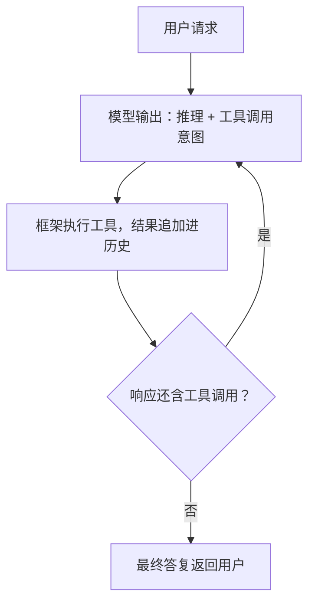

# 1-4 · ReAct 循环：交替求解与终止条件

> 复现条件：Python 3.13+、uv、可用的 Flowing CLI、DeepSeek API key，以及终端网络连接。
> 本篇末尾内联完整配置、脚本、提示词、数据、输入与示例输出；在新建空目录中按标注文件名保存后即可运行。

> 前置：第 1-2 篇“工具调用”

## 这篇讲什么

Agent 的基本求解结构：推理与工具调用交替进行的 ReAct 循环、
循环的显式终止条件，以及循环之外的运行时组成。

## 背景知识

仅让模型输出最终答案时，中间没有可利用的外部信息；仅让模型
逐步调用工具而不留下推理过程时，后续步骤无法参考前面的思考。
ReAct（Reason + Act）方式让模型输出在两类内容之间交替：对
当前局面的推理（文本），以及基于推理的工具调用意图。外部
观察（工具结果）进入历史后，模型据此继续推理。

与“先完整推理再统一执行”相比，交替方式的每一步都有真实
观察作为输入，中间结果可以修正后续步骤，在长任务与多工具
场景下可靠性更高。

## 核心概念

### 循环结构

一次完整的求解过程：



每一次“模型调用 + 可能的工具执行”构成一个迭代单元。框架
通常把这个单元定义为逻辑回合（Turn）：从消费一条消息开始，
到产生不含工具调用的响应为止。

按文末完整示例启动，给一个需要两步
工具调用的任务：“先用 glob 查看 notes 目录有哪些文件，再用
read 读取 使用说明.md，最后用两句话概括”。下面的交互展示这一
过程；所需输入、数据和工具结果均在文末内联：

完整的可见用户输入、工具调用、工具结果与最终答复在文末示例中
逐项列出；这里不重复截断的路径或文件内容。

逐行看循环的交替：第一轮模型只提议了 glob，框架执行并回喂；
模型看到目录清单后第二轮才提议 read——第二轮调用的参数选择
依赖于第一轮的观察，这正是交替求解的价值；读完文件后第三轮
不再包含工具调用，循环走到主出口，最终答复返回。
该回合在历史中留下完整链条：用户消息、模型响应与工具结果交替排列。

### 终止条件

循环必须有显式出口，否则模型可以无限次地“再查一下”。标准
出口是**响应中不再包含工具调用意图**（上面的例子即由此收尾）；
工程上通常还会叠加辅助出口：预算上限（轮数 / token）、时间
上限、断言条件（例如要求最终答复包含某个标记）。

断言型终止条件的概念形态：每轮收尾检查一个谓词，不满足则以
一条普通消息驱动下一轮，满足才允许结束：

```python
def finished(round_result) -> bool:
    return "DONE" in round_result.text     # 业务定义的完成标记

# 框架行为：finished(response) 为假 → 追加提示消息进入下一轮；
#          为真 → 回合结束。同时叠加轮数上限防失控。
```

文末完整配置也给出了这条断言的可运行形态。用另一种命令启动：

```console
$ uv run flowing repl . --strict done
```

再输入“只回复『好的』两个字，什么都不要加”。下面给出完整输入
和示例输出：

```console
(agent-main)>>> 只回复“好的”两个字，什么都不要加。
好的
[steer] 验收条件未满足：你的最终回复必须包含单独一行的 DONE。请重新回答刚才的问题，并在末尾附上 DONE。
好的
```

逐行看：模型按你的要求答了“好的”；回合收尾时断言检查发现
答复里没有 DONE，于是框架自动追加一条导向消息（`[steer]` 行）
驱动了新一轮；模型在新一轮里依然答“好的”。这个循环会一直
持续（`/exit` 终止会话）——断言出口是真实生效的终止条件，
不满足就不让循环结束。

### 循环之外的运行时

ReAct 是求解算法，不是完整系统。在其之外还需要：

- **消息排队**：多条输入（用户消息、外部事件、其他 Agent 的
  回执）按序进入循环（第 2-1 篇）；
- **并发与取消**：任务执行中需要支持中断与部分结果保留
  （第 2-1 篇）；
- **历史持久化**：跨进程的会话恢复（第 3-2 篇）；
- **拦截扩展点**：执行前后插入审批、改写、观测（第 2-4 篇）。

## 完整示例：ReAct 工具循环与收尾断言

在新建空目录中创建 `notes/`，并保存以下文件。将 `...` 替换为自己的
API key 并仅设置为环境变量，真实凭证不得写入文件。所有运行代码、
声明、提示词、输入与数据均在
本文内；`<project-root>` 只是示例输出中的机器无关占位符。

`pyproject.toml`：

```toml
[project]
name = "flowing-chapter-1-4"
version = "0.1.0"
requires-python = ">=3.13"
dependencies = ["flowing-agent"]

[tool.uv]
package = false
```

`main.py`：

```python
from flowing import Runtime


async def main(strict: str | None = None) -> Runtime:
    runtime = Runtime(persist_dir="@/.flowing")
    # runtime.set_providers("@/providers.yaml")
    # runtime.set_models("@/models.yaml")
    runtime.set_model_tags("@/model-tags.yaml")
    kwargs = {"strict": strict} if strict else {}
    await runtime.mount("@/root.fya", agent_id="agent-main", **kwargs)
    return runtime
```

`root.fya`（完整提示词、工具表和收尾逻辑）：

```yaml
description: 项目问答助手：能查看目录、读取文件并总结。
model_tag: default
args:
  strict:
    type: string
    default: ""
    description: 设为 done 时启用答复必须含 DONE 的收尾断言
tools:
  - read
  - glob
---
$system_prompt:
你是项目问答助手。本项目的根目录绝对路径是 {{ env.PWD }}（调用文件工具时一律使用该绝对路径，不要猜其它目录）。当问题涉及项目内容时，先用 glob 查看目录结构、再用 read 读取相关文件，然后根据读到的内容回答；不要凭印象编造。回答控制在五句话以内。
---
$script:
from flowing import MessageKind, TextBlock
from flowing.composables import use_prompt_until


async def setup(self, strict: str = ""):
    if strict != "done":
        return

    def _done(agent, turn) -> bool:
        for mid in reversed(turn.message_ids):
            msg = agent.chain.get(mid)
            if msg.kind is MessageKind.PROVIDER:
                text = "".join(b.text for b in msg.content
                               if isinstance(b, TextBlock))
                return "DONE" in text
        return True

    use_prompt_until(
        self,
        predicate=_done,
        message=("验收条件未满足：你的最终回复必须包含单独一行的 DONE。"
                 "请重新回答刚才的问题，并在末尾附上 DONE。"),
    )
```

`providers.yaml`：

```yaml
deepseek:
  adapter: deepseek
  base_url: https://api.deepseek.com
  api_key: "{{env.DEEPSEEK_API_KEY}}"
```

`models.yaml`：

```yaml
deepseek-flash:
  provider: deepseek
  model: deepseek-v4-flash
```

`model-tags.yaml`：

```yaml
tags:
  default: deepseek-flash
```

在保存了本文所列文件的当前目录运行：

```sh
uv sync
export DEEPSEEK_API_KEY="..."
uv run flowing repl .
uv run flowing repl . --strict done
```

完整可读数据：

`notes/使用说明.md`：

```markdown
# 使用说明

本目录是一个演示用笔记库。

## 安装

需要 Python 3.13 或更高版本。

## 常用命令

- `uv sync`：安装依赖
- `uv run pytest`：运行测试

## 注意事项

凭证一律经环境变量持有，不要写进任何文件。
```

`notes/路线图.md`：

```markdown
# 路线图

- 2026-Q3：完成核心功能
- 2026-Q4：发布 1.0 版本
```

运行 `uv run flowing repl .` 后输入：

```text
先用 glob 查看 notes 目录有哪些文件，再用 read 读取 使用说明.md，最后用两句话概括它讲了什么。
/exit
```

该次求解的代表性交互（模型措辞可能变化；工具结果内容完整列出）：

```console
(agent-main)>>>先用 glob 查看 notes 目录有哪些文件，再用 read 读取 使用说明.md，最后用两句话概括它讲了什么。
[tool_call] glob {"pattern": "**/*", "path": "<project-root>/notes"}
[tool:completed] glob -> <project-root>/notes/使用说明.md
<project-root>/notes/路线图.md
[tool_call] read {"path": "<project-root>/notes/使用说明.md"}
[tool:completed] read -> 0  # 使用说明
1
2  本目录是一个演示用笔记库。
3
4  ## 安装
5
6  需要 Python 3.13 或更高版本。
7
8  ## 常用命令
9
10 - `uv sync`：安装依赖
11 - `uv run pytest`：运行测试
12
13 ## 注意事项
14
15 凭证一律经环境变量持有，不要写进任何文件。
notes 目录下有两个文件。使用说明指出这是演示用笔记库，要求 Python 3.13 或更高版本，并列出安装依赖与运行测试的命令。它还要求凭证只通过环境变量持有。
(agent-main)>>>/exit
```

收尾断言演示的启动命令和输入如下：

```console
$ uv run flowing repl . --strict done
```

```text
只回复“好的”两个字，什么都不要加。
/exit
```

代表性交互如下。该输入故意不含 `DONE`，因此断言继续请求模型回答；
此时可输入 `/exit` 结束会话。满足断言时的输入是“用一句话介绍你自己，
并在末尾附上 DONE”，预期最终答复包含单独一行 `DONE`。

```console
(agent-main)>>>只回复“好的”两个字，什么都不要加。
好的
[steer] 验收条件未满足：你的最终回复必须包含单独一行的 DONE。请重新回答刚才的问题，并在末尾附上 DONE。
好的
(agent-main)>>>/exit
```

上面的消息树行以语义摘要展示 provider/tool 节点；实际模型文本会变化。

## 常见误区

1. **依赖循环隐式终止**。没有出口条件的循环存在失控风险；
   终止条件是系统配置的一部分；
2. **把 ReAct 当作完整架构**。它只定义单次求解的内部结构；
   排队、持久化、拦截是另外的系统组成；
3. **迭代单元不设上限**。即使终止条件正确，也应叠加轮数与
   token 预算，限制故障时的成本。

## 练习

1. 为“调研一个开源库并写评估报告”设计 ReAct 循环的迭代
   序列（推理 → 调用 → 观察），标出每步的可验证观察；
2. 给出该任务的三项终止条件（主出口 + 两项辅助上限），说明
   各自防住的故障模式；
3. 在下方完整示例的 `--strict done` 会话里改问一个普通问题并正常
   带 DONE 结尾的要求（例如“用一句话介绍你自己，末尾附
   DONE”），观察断言满足时循环正常结束。

## 小结

1. ReAct 循环推理与行动交替，观察修正后续步骤；
2. 每个迭代单元构成一个逻辑回合；
3. 终止条件是显式配置：主出口为无工具调用，辅助上限防失控；
4. 循环之外还需要排队、并发、持久化与拦截，分别在第 2、3 章
   讨论。
