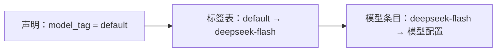

# 2-3 · 装配与参数化：schema 即合同与创建期校验

> 示例运行前提：环境中已安装 Flowing CLI，并已自行设置 `DEEPSEEK_API_KEY`；下文逐项给出运行所需文件全文。请在包含这些文件的工作目录中执行命令。
> 运行：`uv run flowing repl . --user_name 小红 --locale zh`
> 继续对话：在同一工作目录再次执行同一命令；缺参负例请使用全新的工作目录。

> 前置：第 1-1 篇“智能体运行时”

## 这篇讲什么

Agent 作为可复用组件的装配方式：声明与装配的分离、参数 schema
作为合同、创建期校验，以及逻辑名到物理实现的间接层。

## 背景知识

同一个 Agent 逻辑服务不同用户、不同环境时，差异应以参数形式
进入，而不是复制代码。参数化是组件复用的基本手段；问题的工程
部分在于：参数如何声明、如何校验、在哪里装配。

## 核心概念

### 声明、装配、配置的三分

一个 Agent 工程的文件按职责分三类：

| 层 | 内容 | 变更动机 |
|---|---|---|
| 声明 | Agent 是什么：角色、能力、提示词 | 修改行为 |
| 装配 | 如何创建：构造、挂载、依赖注入 | 修改装配方式 |
| 配置 | 运行环境：模型、凭证、开关 | 修改环境 |

三分的收益是常规的组合式收益：行为、装配、环境各自演化、
互不牵连。装配层在依赖注入文献中称为组合根（composition
root）——整个对象图在一个可审查的位置装配完成。

本篇给出的完整材料展示了三分：Agent 声明负责角色、参数与提示词；
入口函数创建 Runtime、登记配置并挂载 Agent；配置分别描述模型服务、
模型条目与标签映射。

### 完整示例材料

以下内容构成一个最小运行实例。每段代码块标题给出应创建的相对文件名，
文件正文完整列在块内；模型凭证只通过 `DEEPSEEK_API_KEY` 环境变量提供。

#### `root.fya`

```yaml
description: 参数演示助手：args 声明 + setup() 典型写法。
model_tag: default
args:
  user_name: str
  locale:
    type: string
    default: zh
    description: 回复语言（zh / en）
---
$system_prompt:
你是简洁的问答助手。当前用户：{{ user_name }}；回复语言：{{ locale }}；
时区：{{ timezone }}。回答控制在一句话以内。
---
$script:
async def setup(self, user_name: str, locale: str = "zh"):
    self.user_name = user_name
    self.locale = locale
    self.ask_count = 0
    self.provide("locale", locale)
    self.timezone = self.inject("timezone")
```

#### `main.py`

```python
from flowing import Runtime


async def main(user_name: str | None = None, locale: str = "zh",
               resume: str | None = None) -> Runtime:
    runtime = Runtime(persist_dir="@/.flowing")
    # runtime.set_providers("@/providers.yaml")
    # runtime.set_models("@/models.yaml")
    runtime.set_model_tags("@/model-tags.yaml")
    runtime.provide("timezone", "Asia/Shanghai")
    if resume is not None:
        await runtime.recover_agent(resume)
    else:
        kwargs: dict = {}
        if user_name is not None:
            kwargs["user_name"] = user_name
        if locale != "zh":
            kwargs["locale"] = locale
        await runtime.mount("@/root.fya", agent_id="agent-main", **kwargs)
    return runtime
```

#### `providers.yaml`

```yaml
deepseek:
  adapter: deepseek
  base_url: https://api.deepseek.com
  api_key: "{{env.DEEPSEEK_API_KEY}}"
```

#### `models.yaml`

```yaml
deepseek-flash:
  provider: deepseek
  model: deepseek-v4-flash
```

#### `model-tags.yaml`

```yaml
tags:
  default: deepseek-flash
```

#### 对话输入与可见输出

在包含上述相对文件的工作目录中运行：

```console
$ uv run flowing repl . --user_name 小红 --locale zh
(agent-main)>>> 请用中文一句话汇报：当前用户是谁、locale 是什么、时区是什么？
[thinking] (reasoning trace omitted)
当前用户是小红，locale 为 zh，时区为 Asia/Shanghai。
```

启动期缺少必填参数时，可在一份全新的工作目录中运行以下负例。失败启动
可能已创建部分会话状态，因此不要在同一状态目录里紧接着运行正常命令：

```console
$ uv run flowing repl .
launch failed: RootAgent.setup() missing 1 required positional argument: 'user_name'
```

### 参数 schema 即合同

参数的声明形式是 schema：每个参数的名称、类型、默认值、说明。
schema 同时服务三个读者：

- 构造器按它校验入参；
- 模型侧的调用界面（如子智能体目录中的参数表）按它生成；
- 文档读者按它理解组件的输入面。

一份声明三处生效，因此 schema 必须保持单一来源；手工同步多份
拷贝迟早漂移。完整 Agent 声明中的参数（两种等价写法并存）为：

```yaml
args:
  user_name: str                 # 必填：裸类型简写
  locale:
    type: string
    default: zh                  # 有默认值即可选
    description: 回复语言（zh / en）
```

必填性由“有无默认值”派生：`user_name` 没有默认值所以必填，
`locale` 有默认值所以可选。完整对话输入与可见输出列在上方的
“完整示例材料”中。回答里的三个值各有一条来路：`小红` 与 `zh` 来自命令行
参数（经装配层转发给创建管线、进入提示词模板），`Asia/Shanghai`
来自装配层在挂载前向运行时注册的一个共享值（第 3-1 篇讨论
这种共享通道）。参数声明里的每个占位都在回答中现形，说明
schema 驱动的装配链路完整走通。

### 创建期校验（fail-fast）

必填参数缺失、类型不兼容，应在**创建组件时**报错，而不是第一
次调用时才失败。上方完整示例材料包含了不带 `--user_name` 的启动负例。

这条报错只在初始形态（工作目录中无 `.flowing/`）下成立：目录中已有状态时，
启动不再走创建期校验，而是按固定 `agent_id` 幂等挂载既有会话并静默恢复，
因此缺参负例应在全新的工作目录中运行。

还有一面需要留意：报错演示本身就会把目录变成“有状态”的——启动失败
发生在校验阶段，而创建管线在此之前已经建立会话目录并写出身份数据。
因此演示完缺参报错，紧接着执行正常命令时，
本次启动会把这个残缺目录当成既有会话，直接报出
`session directory already exists`（提示改 `agent_id`、删除目录或经
ops 恢复），正常会话仍然起不来。演示缺参报错与跑正常会话之间必须清理
`.flowing/`：正确做法是在两个独立的全新工作目录中分别运行负例与正常命令，
避免清理或复用失败启动产生的状态。

进程在启动阶段直接退出——错误现场就是病因现场（缺参数的
启动命令），不需要等第一轮对话失败后再回溯日志。这条原则对
Agent 系统尤其重要：Agent 的首次失败可能发生在无人值守的
运行中。

### 逻辑名与实现的间接层

组件引用物理资源（模型、工具、数据源）时应经过逻辑名查表，
而不是直接写死实现标识：



收益是常规的间接层收益：换实现不改代码；不同环境同名逻辑名
指向不同实现（测试环境 `default` 指向测试模型）；配置独立于
代码库管理。Agent 声明只写了 `model_tag: default`，真实的模型 ID
只出现在配置层的模型条目中。

### 集合引用：glob 命名模式

间接层的批量形态：声明处写一个模式，装配时展开成多个资源。
`tools:` / `subagents:` / `skills:` 列表的条目支持 glob——命中是
两个空间的并集：文件系统（路径模式，如 `./tools/*`、
`@/agents/**`）与注册表键（名字模式，如 `demo--*`、
`builtin::rea?`）。同一资源多路命中按注册表键去重；别名撞车时
已收条目胜出并告警。模式按装配时点的存在性展开，不做运行期
监听——glob 是快照，不是订阅。

## 常见误区

1. **参数缺省由调用处兜底**。缺省应写在声明里；调用处兜底让
   默认值散落多处，schema 不再是单一事实源；
2. **运行期才报配置错误**。必填缺失应在创建期失败；能早报的
   错误不要留到运行期；
3. **代码里写死模型 ID**。经逻辑名引用，环境差异收敛到配置。

## 练习

1. 为“报告生成 Agent”声明三个参数（格式、语言、交付目录），
   标出必填与可选，说明每个参数的 schema 读者是谁；
2. 画一张装配图：从进程入口到第一个回合开始，标出组合根的位置
   与创建期校验的发生点；
3. 在初始形态（工作目录中无 `.flowing/`）下，把上方完整 Agent 声明的 `locale`
   改成必填（删掉 `default` 行），重新运行不带 `--locale` 的
   命令，验证创建期报错的内容随之变化。

## 小结

1. 声明、装配、配置三分，各自独立演化；
2. 参数 schema 同时服务构造校验、模型界面与文档，须单一来源；
3. 创建期校验让错误现场就是病因现场；
4. 逻辑名经查表映射到实现，环境差异收敛到配置。
