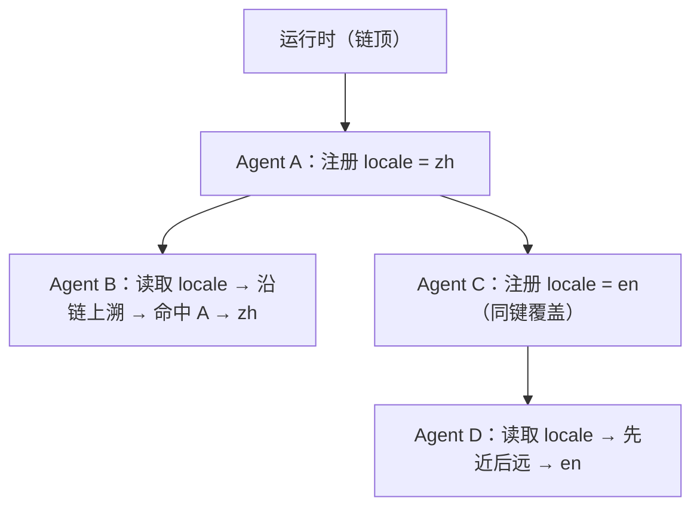

# 3-1 · 跨层共享：依赖注入、作用域与敏感数据

> 示例运行前提：环境中已安装 Flowing CLI，并已自行设置 `DEEPSEEK_API_KEY`；下文逐项给出运行所需文件全文。
> 英文问候：`uv run flowing repl . --locale en`；中文对照：在另一份全新的工作目录中运行 `uv run flowing repl .`（默认 `zh`）。
> 边界演示：`uv run python demo_boundary.py`。所有命令均在包含对应内联文件的工作目录中运行。

> 前置：第 2-3 篇“装配与参数化”

## 这篇讲什么

多层组件（Agent 与其子组件）之间共享运行期值的机制：依赖注入
与作用域链的通用概念、值通道与敏感数据的边界。

## 背景知识

组件需要访问其环境提供的值：配置、当前用户、工作目录、语言
设置。直接在组件内部获取全局状态（环境变量单例、模块级常量）
会让组件与环境耦合，无法独立测试、无法同一进程跑多份配置。

依赖注入（Dependency Injection）是标准解法：组件声明“我需要
什么”，由装配方在构造时提供。Agent 系统中的特别之处在于组件
有层级——子组件能访问哪些值、按什么顺序查找，需要一套作用域
规则。

## 核心概念

### 值注册与上溯查找

层级系统的通用方案：每个节点可注册键值，查找从当前节点出发
沿亲代链向上，命中即返回，链顶未命中则报错。



规则要点：

- **先近后远**：子级注册遮蔽上级，局部配置优先——与编程语言
  的作用域链一致；
- **实时查找**：每次读取都重新沿链查找，注册方可随时覆盖更新——
  运行期切换配置（语言、模式）因此成为常规操作；
- **未命中即错**：查不到是装配错误，应显式报错而非返回空值。

下面的伪代码只说明查找关系；`parent` 与 `child` 表示组件实例。

```python
# 概念形态：注册方与消费方互不持有对方引用
parent.provide("workspace", "workspace-root") # 装配期注册
value = child.inject("workspace")            # 使用时上溯查找
```

### 完整示例材料

以下代码块标题给出应创建的相对文件名，块内均为完整文件内容。为避免会话
恢复影响 locale 对照，请用两份分别新建的工作目录运行两条命令；凭证通过
`DEEPSEEK_API_KEY` 环境变量提供。

#### `root.fya`

```yaml
description: 编排者：provide locale，把问候任务派给问候员。
model_tag: default
args:
  locale:
    type: string
    default: zh
tools:
  - subagent-invoke
subagents:
  - ./agents/greeter
---
$system_prompt:
你是编排者。收到问候请求时，调用 subagent-invoke 派给问候员 greeter
（不传参数），用它的问候语回答用户。
---
$script:
async def setup(self, locale: str = "zh"):
    self.locale = locale
    self.provide("locale", locale)
```

#### `agents/greeter/agent.fya`

```yaml
description: 问候员：按链上提供的 locale 用对应语言问候。
model_tag: default
---
$system_prompt:
你是问候员。locale = {{ locale }}。
请用中文问候用户。请用英文问候用户。
只输出问候语本身。
---
$script:
async def setup(self):
    self.locale = self.inject("locale")
```

#### `main.py`

```python
from flowing import Runtime


async def main(user_name: str | None = None, locale: str = "zh") -> Runtime:
    runtime = Runtime(persist_dir="@/.flowing")
    # runtime.set_providers("@/providers.yaml")
    # runtime.set_models("@/models.yaml")
    runtime.set_model_tags("@/model-tags.yaml")
    runtime.provide("timezone", "Asia/Shanghai")
    kwargs: dict = {}
    if user_name is not None:
        kwargs["user_name"] = user_name
    if locale != "zh":
        kwargs["locale"] = locale
    await runtime.mount("@/root.fya", agent_id="agent-main", **kwargs)
    return runtime
```

#### `providers.yaml`

```yaml
deepseek:
  adapter: deepseek
  base_url: https://api.deepseek.com
  api_key: "{{env.DEEPSEEK_API_KEY}}"
```

#### `models.yaml`

```yaml
deepseek-flash:
  provider: deepseek
  model: deepseek-v4-flash
```

#### `model-tags.yaml`

```yaml
tags:
  default: deepseek-flash
```

#### 英文 locale 的对话

在包含上述文件的工作目录中运行 `uv run flowing repl . --locale en`，
输入以下请求；结束后输入 `/exit`：

```console
(agent-main)>>> 请派 greeter 问候我。
[thinking] (reasoning trace omitted)
[tool_call] subagent-invoke {"agent_type": "greeter", "prompt": "问候用户。"}
[tool:completed] subagent-invoke ->
问候员 greeter 的问候语如下：

**Hello!**
(agent-main)>>> /exit
```

#### 默认中文 locale 的对话

在另一份全新的工作目录中运行 `uv run flowing repl .`，输入同一句请求：

```console
(agent-main)>>> 请派 greeter 问候我。
[thinking] (reasoning trace omitted)
[tool_call] subagent-invoke {"agent_type": "greeter", "prompt": "请向用户问好。"}
[tool:completed] subagent-invoke ->
问候员 greeter 的问候语如下：

> 你好！很高兴见到你，有什么我可以帮你的吗？
(agent-main)>>> /exit
```

#### `demo_boundary.py`

```python
import asyncio

from flowing import launch
from flowing.errors import MissingProvideError


async def main() -> None:
    runtime = await launch(".")
    agent = await runtime.get_agent("agent-main")
    try:
        agent.inject("no_such_key")
    except MissingProvideError as exc:
        print(f"inject 未命中 → MissingProvideError: {exc}")
    await runtime.shutdown()


asyncio.run(main())
```

运行 `uv run python demo_boundary.py` 的输出：

```text
inject 未命中 → MissingProvideError: Missing provide value for key: 'no_such_key'
```

两段输出对照看：问候员是每次被唤起时才创建的新实例，它的
语言参数不是调用方传进去的——根 Agent 在装配时把 `locale`
注册到了共享链上，问候员创建时沿亲代链上溯取到了它。注册方
换一个值（en 换成 zh），子组件的行为随之切换，两方代码都没
有改动。

### 敏感数据的边界

共享通道里的值分两类，边界不同：

- **普通运行期值**（工作目录、语言、主题）：可进日志、可展示；
- **敏感值**（凭证、用户身份）：不应进入对话上下文、不应落盘、
  不应出现在观测输出里。

注入通道天然适合敏感值：它不进消息流、不进模型上下文。但“沿
链对后代可见”意味着可见范围会随层级扩大——凭证应在尽量深的
节点注册，把可见面收窄到真正需要的子树。需要更大范围共享的重
资源（连接池、客户端）则不属于注入通道的职责，应走直引共享。

“未命中即错”的边界可以直接观察。完整的边界演示程序及输出
已列在上方示例材料中。

查找一个不存在的键，得到的是明确的异常而不是空值——装配错误
在第一时间暴露，不会以“空配置”的形态潜伏到运行后期。

### 模板与注入的协作

运行期值要被提示词消费时，需要一个显式的取值步骤：先注入到
实例属性，再被模板引用。模板不直接读取注入链——取值时机与
渲染时机分离，保持数据流向可审查。本篇示例里问候员的
`{{ locale }}` 就是这么来的：它的 `setup()` 先把注入值存到
实例属性，提示词模板再引用这个属性。

## 常见误区

1. **用模块级全局变量共享**。同一进程多配置时互相污染，也无法
   按子树收窄可见面；
2. **凭证在根节点注册**。沿链全树可见；应在所需子树的最深
   公共节点注册；
3. **注入值直接进模板**。经实例属性中转，保持取值时机明确。

## 练习

1. 设计一个三层结构（应用 → 会话 → 任务 Agent），标出 locale、
   数据库连接、当前用户三个值各自的注册位置与通道选择；
2. 说明为什么“实时查找”让运行期切换语言成为可能；如果改成
   构造时快照，会失去什么；
3. 把上方完整根 Agent 声明里的 `locale` 参数默认值从 `zh` 改成
   `en`，不带参数重跑对话，观察问候语言的变化，并写出这个值
   从启动到提示词的完整流经路径。

## 小结

1. 层级系统用“注册 + 上溯查找”共享运行期值，规则为先近后远、
   实时查找、未命中即错；
2. 敏感值走注入通道（不进上下文、不落盘），并在深层节点收窄
   可见面；重资源走直引共享；
3. 模板消费注入值须经显式取值，数据流向保持可审查。
