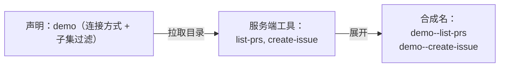

# 4-1 · 协议化工具接入：MCP 与传输形态

> 示例运行前提：环境中已安装 Flowing CLI 与 MCP Python SDK，并已自行设置 `DEEPSEEK_API_KEY`；下文逐项给出运行所需文件全文。
> 对话：`uv run flowing repl .`；凭证边界演示：`uv run python demo_env_failfast.py`。命令均在包含对应内联文件的工作目录中运行。

> 前置：第 1-2 篇“工具调用”

## 这篇讲什么

工具来源的协议化：当工具不由自己编写而由第三方提供时，工具
目录如何跨进程描述与发现。以 MCP 为例讲协议化接入的结构与
传输形态取舍。

## 背景知识

第 1-2 篇的工具调用约定解决“模型与框架之间”的工具描述；
但工具本身常由另一个进程提供——数据库工具、SaaS 插件、同事
写的内部服务。跨进程的工具供给需要再上一层协议：约定工具
目录如何拉取、调用如何传输、凭证如何传递。

MCP（Model Context Protocol）是这一层的行业协议：服务侧暴露
工具目录与调用端点，客户端（Agent 框架）按目录生成自己的工具
表示。协议的价值在于解耦：工具作者只需实现一次 MCP 服务，即可
被任意兼容框架使用；框架侧按协议接入，不再需要为每个工具写
专用适配。

## 核心概念

### 组代理：一次声明接入一组工具

协议化接入的对象通常不是单个工具而是一组工具（一个 MCP 服务
导出多个工具）。声明因此是**组代理**形态：声明连接方式，框架
拉取目录后按合成名展开为实际工具。



合成名的作用是命名空间隔离：不同服务可能导出同名工具（两个
服务都有 `search`），以双连字符接声明名为前缀后全局不冲突。
Agent 侧按合成名引用，等价于按“服务.工具”寻址。

### 完整示例材料

以下代码块标题给出应创建的相对文件名，块内均为完整文件内容。stdio
子进程会由工具声明自动启动；模型凭证通过 `DEEPSEEK_API_KEY` 环境变量提供。

#### `root.fya`

```yaml
description: MCP 演示助手：经 demo 工具组查 PR / 建 Issue。
model_tag: default
tools:
  - ./tools/demo
---
$system_prompt:
你是演示助手。用户问 PR 列表时用 demo--list-prs；用户要求创建 Issue 时用
demo--create-issue。回答控制在一句话以内。
```

#### `tools/demo/TOOL.fya`

```yaml
name: demo
type: mcp
description: 演示用的 GitHub 风格操作工具组。
command: uv
args: ["run", "python", "tools/demo_server.py"]
tools: [list-prs, create-issue]
```

#### `tools/demo_server.py`

```python
from __future__ import annotations

import sys

from mcp.server.mcpserver import MCPServer

port = int(sys.argv[2]) if len(sys.argv) > 2 else 0
mcp = MCPServer("demo-github")


@mcp.tool(name="create-issue")
def create_issue(title: str, body: str = "") -> dict:
    """创建 GitHub Issue。"""
    return {"issue_id": 42, "title": title, "body": body,
            "url": "https://example.test/issues/42"}


@mcp.tool(name="list-prs")
def list_prs(state: str = "open") -> list[dict]:
    """列出 Pull Request。"""
    return [{"number": 1, "title": "fix typo", "state": state},
            {"number": 2, "title": "add feature", "state": state}]


if __name__ == "__main__":
    mode = sys.argv[1] if len(sys.argv) > 1 else "stdio"
    transport = {"http": "streamable-http"}.get(mode, mode)
    if transport == "stdio":
        mcp.run(transport="stdio")
    else:
        mcp.run(transport=transport, host="127.0.0.1", port=port)
```

#### `main.py`

```python
from flowing import Runtime


async def main(user_name: str | None = None, locale: str = "zh",
               resume: str | None = None) -> Runtime:
    runtime = Runtime(persist_dir="@/.flowing")
    # runtime.set_providers("@/providers.yaml")
    # runtime.set_models("@/models.yaml")
    runtime.set_model_tags("@/model-tags.yaml")
    runtime.provide("timezone", "Asia/Shanghai")
    if resume is not None:
        await runtime.recover_agent(resume)
    else:
        kwargs: dict = {}
        if user_name is not None:
            kwargs["user_name"] = user_name
        if locale != "zh":
            kwargs["locale"] = locale
        await runtime.mount("@/root.fya", agent_id="agent-main", **kwargs)
    return runtime
```

#### `providers.yaml`

```yaml
deepseek:
  adapter: deepseek
  base_url: https://api.deepseek.com
  api_key: "{{env.DEEPSEEK_API_KEY}}"
```

#### `models.yaml`

```yaml
deepseek-flash:
  provider: deepseek
  model: deepseek-v4-flash
```

#### `model-tags.yaml`

```yaml
tags:
  default: deepseek-flash
```

#### 对话输入与可见输出

在包含这些文件的工作目录中运行 `uv run flowing repl .`，输入：

```text
现在有哪些 PR？然后帮我创建一个标题为“演示 Issue”的 Issue。
/exit
```

可见交互示例如下；`[thinking]` 仅作省略占位：

```console
(agent-main)>>> 现在有哪些 PR？然后帮我创建一个标题为“演示 Issue”的 Issue。
[thinking] (reasoning trace omitted)
[tool_call] demo--list-prs {"state": "open"}
[tool_call] demo--create-issue {"title": "演示 Issue"}
[tool:completed] demo--list-prs ->
[tool:completed] demo--create-issue -> {
  "issue_id": 42,
  "title": "演示 Issue",
  "body": "",
  "url": "https://example.test/issues/42"
}
当前有 2 个开启的 PR（#1 fix typo、#2 add feature），已创建“演示 Issue”（#42）。
(agent-main)>>> /exit
```

#### `demo_env_failfast.py`

```python
import asyncio
import pathlib
import tempfile

from flowing.errors import FormatError
from flowing.tool.registry import ToolRegistry

BOGUS = """name: bogus
type: mcp
description: 凭证模板缺失的声明。
command: python
args: ["server.py"]
env:
  API_KEY: "{{ env.NO_SUCH_VAR }}"
"""


async def main() -> None:
    temporary = pathlib.Path(tempfile.mkdtemp())
    (temporary / "bogus").mkdir()
    (temporary / "bogus" / "TOOL.fya").write_text(BOGUS, encoding="utf-8")
    registry = ToolRegistry(project_root=pathlib.Path.cwd())
    try:
        registry.get("./bogus", source_dir=temporary)
    except FormatError as exc:
        print(f"凭证缺失在装配期 fail fast → FormatError: {exc}")


asyncio.run(main())
```

运行 `uv run python demo_env_failfast.py` 的完整输出：

```text
凭证缺失在装配期 fail fast → FormatError: environment variable referenced by template '{{ env.NO_SUCH_VAR }}' is missing: 'mappingproxy object' has no attribute 'NO_SUCH_VAR'
```

逐行看：两行 `[tool_call]` 的工具名都是合成名（`demo--` 前缀 +
服务端工具名），Agent 像调普通工具一样并行调用了它们，参数
完整可见（`demo--list-prs` 带了查询参数 `state`，
`demo--create-issue` 带了 `title`）；第二个
回执里是服务端返回的结构化数据（`issue_id: 42`），进入了最终
回答。对 Agent 而言，协议化接入的工具与本地工具的使用体验
完全一致——差别只在声明与装配。

### 传输形态：stdio 与远程

两种连接方式的取舍：

| 维度 | stdio（本地子进程） | 远程（HTTP/SSE） |
|---|---|---|
| 部署 | 随项目分发，启动即拉起 | 独立服务，多客户端共享 |
| 凭证 | 经子进程环境传递，不出本机 | 经请求头传递，走网络 |
| 信任边界 | 本机信任域 | 网络信任域，需考虑鉴权与传输安全 |
| 适用 | 本地工具、开发期、单用户 | 共享服务、生产部署、多租户 |

选择依据是信任与运维边界：本地脚本工具走 stdio；团队共享的
能力服务走远程端点。本篇示例用的是 stdio——运行对话时你会
看到工程没有手工启动任何服务，子进程由声明自动拉起。

### 凭证的装配期校验

协议化声明中常内嵌凭证引用（环境变量模板）。缺失凭证应在
**声明装配时**报错，而不是首次调用时才失败——与第 2-3 篇的
创建期校验同一原则，只是发生位置在声明加载处。

运行上方完整程序即可观察装配期缺失环境变量的完整错误输出。

这一行就是装配期校验的现场：声明加载阶段直接抛出格式错误，
进程没有机会走到第一次真实调用才发现凭证缺失。

## 常见误区

1. **按单个工具设计协议化接入**。协议化接入的单位是服务（一组
   工具）；单工具思维会导致每个工具一条连接；
2. **忽略命名空间**。跨服务同名工具必须可区分；合成名是默认
   答案；
3. **调用期才发现凭证缺失**。装配期校验，失败要早于一切调用。

## 练习

1. 一个团队要接入三个 MCP 服务（本地文件服务、远程搜索服务、
   远程数据库服务），为每个选择传输形态并说明依据；
2. 画组代理的展开时序：声明 → 拉目录 → 合成名注册 → Agent
   按合成名调用；
3. 修改上方内联工具组声明中的 `tools:` 子集，把它缩到只剩
   `list-prs`，重新运行对话并观察 Agent 对“创建 Issue”请求
   的回应有什么变化。

## 小结

1. 协议化接入解决跨进程的工具供给，MCP 是其行业形态；
2. 声明是组代理，按合成名展开实现命名空间隔离；
3. stdio 与远程的选择依据信任与运维边界；
4. 凭证在装配期校验，缺失早报。
