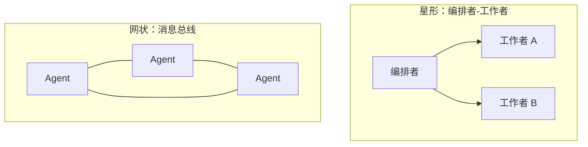

# 5-2 · 组织模式全景

> 自包含示例：本篇下方完整列出配置、Agent、工具、目标项目数据、输入与代表性输出。创建这些相对文件后，在当前目录运行 `uv run flowing repl . --cwd target`；并行演示可运行 `uv run python demo_fanout.py`。
> 对话示例需要 `DEEPSEEK_API_KEY` 环境变量；不要把真实凭证写入文件。

> 前置：第 5-1 篇“拆分的动因与成本”

## 这篇讲什么

多智能体系统的五种组织模式：结构、协作协议、适用场景，以及
按什么标准选择。

## 背景知识

组织模式回答一个问题：多个 Agent 之间，**谁决定谁做什么、结果
流向哪里**。不同模式的选择与软件架构模式的选择同构——没有最优，
只有与任务结构匹配。

## 核心概念

### 五种模式

| 模式 | 结构 | 协作协议 | 适用 |
|---|---|---|---|
| 编排者-工作者 | 一个调度者 + 若干工人 | 调度者派单 → 工人执行 → 结果回调度者汇总 | 任务可拆解、工人职责异构 |
| 路由器 | 一个前置分类器 + 完全特化的后端 | 分类器只做一次转发，不汇总 | 请求类型离散、后端无协作 |
| 层级团队 | 树形：中间层既被调度也调度他人 | 逐层委派与汇总 | 协作规模大、管理半径超限 |
| 消息总线 | 无中心，Agent 按主题收发 | 发布/订阅，各自决定响应 | 无明确调度者的协作 |
| 程序化 fan-out | 代码并行创建同构 Agent | 代码等待全部完成（gather） | 批量同构任务 |



### 模式间的关键差异维度

选择时实际在比较三个维度：

1. **决策位置**：调度决策在模型（编排者 / 路由器）还是在代码
   （程序化 fan-out）。模型决策灵活但不确定；代码决策确定但不
   自适应；
2. **中间层职责**：是否加工结果。编排者汇总、路由器不碰、
   fan-out 由代码合并；
3. **拓扑**：星形（中心调度）、树形（层级）、网状（总线）。拓扑
   决定一致性的维护难度。

本篇示例同时展示编排者-工作者与程序化 fan-out。先创建本篇后文列出的完整干净夹具；目标项目初始没有 README。运行命令后输入：

**输入**

```text
先派 explore 检查 target 的目录结构并汇报。收到结果后用 todo 将“为这个项目写 README.md”拆成任务清单，再派 coder 完成 README，并向我汇报交付结果。
/exit
```

**代表性流程输出**

```text
(agent-main)>>> 先派 explore 检查 target 的目录结构并汇报。收到结果后用 todo 将“为这个项目写 README.md”拆成任务清单，再派 coder 完成 README，并向我汇报交付结果。
[thinking] (reasoning trace omitted)
[tool_call] subagent-invoke {"agent_type":"explore-agent","name":"explore-target","prompt":"只读检查 target：列出目录树，说明 Python 文件、笔记文件、配置与测试是否存在；不要修改内容。"}
[tool:completed] subagent-invoke ->
target 包含 pkg/calc.py，以及分别说明 adder 与 divider 术语的两个 Markdown 笔记；这是只用 Python 标准库的计算器项目，初始没有 README、依赖配置或测试。
[thinking] (reasoning trace omitted)
[tool_call] todo {"tasks_text":"1. 汇总目标结构与函数行为\n2. 规划 README 的项目介绍、结构、使用方法、API、术语和约定\n3. 撰写 README\n4. 对照函数行为检查 README\n5. 汇报交付"}
[tool:completed] todo ->
任务清单已生成：5 项。
[thinking] (reasoning trace omitted)
[tool_call] subagent-invoke {"agent_type":"coder","name":"readme-writer","prompt":"根据本篇完整列出的 target 数据，为项目撰写 README.md。说明 add 与 div 的签名、行为和除零异常；不要声称存在未给出的功能。完成后汇报改动文件与自检结果。"}
[tool:completed] subagent-invoke ->
README 已创建并完成自检；结构、命令、API 行为与给定数据一致。
(agent-main)>>>
```

模型生成的具体 README 措辞不保证一致；可检查的结果是派单顺序、任务清单，以及 coder 在给定工作目录中交付 README。

下面是一份完整的代表性 README 输出。实际模型措辞可能不同；此版本只描述本页内联的函数与术语数据。

**代表性生成结果：`target/README.md`**

````markdown
# 计算器项目

这是一个使用 Python 标准库的简单计算器示例，提供加法和除法函数。

## 项目结构

```text
pkg/calc.py
notes/adder.md
notes/divider.md
```

## API

### `add(a: float, b: float) -> float`

返回 `a` 与 `b` 的和。

### `div(a: float, b: float) -> float`

返回 `a` 除以 `b` 的商。`b` 为零时抛出 `ValueError`。

## 用法

```python
from pkg.calc import add, div

print(add(2, 3))  # 5
print(div(6, 4))  # 1.5
```

## 术语

- `adder` 指 `add(a, b)` 加法操作。
- `divider` 指 `div(a, b)` 除法操作。

## 约定

函数参数和返回值带有 `float` 类型标注；项目使用 Python 标准库，不声明额外依赖。

本项目没有测试套件或命令行入口。
````

这是**编排者-工作者**：派谁、先派谁的决策由编排者的模型做出
（它判断探查是拆清单的前提，先派 explore、拿到汇报后才建清单），
结果都回到编排者处汇总成一份报告。

再运行 `uv run python demo_fanout.py`：

```console
coder-a: status=completed
coder-b: status=completed
```

这是**程序化 fan-out**：脚本代码直接创建两个同构的 coder 实例
并行写两份术语说明；派单与合并完全不经模型——决策位置从模型挪到
了代码。两个演示的差异只在驱动方式。

### 完整示例材料

以下是运行本篇两个演示所需的全部应用文件与最小目标数据。按所示相对文件名创建；目标项目初始不含 README。`explore-agent` 为 Flowing 内置只读子智能体。

```console
export DEEPSEEK_API_KEY=sk-your-key-here
```

**`providers.yaml`**

```yaml
deepseek:
  adapter: deepseek
  base_url: https://api.deepseek.com
  api_key: "{{env.DEEPSEEK_API_KEY}}"
```

**`models.yaml`**

```yaml
deepseek-flash:
  provider: deepseek
  model: deepseek-v4-flash
```

**`model-tags.yaml`**

```yaml
tags:
  default: deepseek-flash
```

**`main.py`**

```python
from flowing import Runtime


async def main(cwd: str | None = None) -> Runtime:
    runtime = Runtime(persist_dir="@/.flowing")
    # runtime.set_providers("@/providers.yaml")
    # runtime.set_models("@/models.yaml")
    runtime.set_model_tags("@/model-tags.yaml")
    if cwd:
        runtime.provide("cwd", cwd)
    await runtime.mount("@/root.fya", agent_id="agent-main")
    return runtime
```

**`root.fya`**

```yaml
description: 编程任务编排者：探查结构、拆解任务、委派实现。
model_tag: default
tools:
  - subagent-invoke
  - ./tools/todo.py
subagents:
  - builtin::explore-agent
  - ./agents/coder
---
$system_prompt:
你是编程任务编排者。工作目录：{{ cwd }}。
先派 explore-agent 只读检查结构，再用 todo 把实现任务拆成清单，最后派 coder 编写。
你自己不得读写目标项目文件。把目标路径与所需背景明确写入子任务。
完成后向用户汇报实际交付结果。
---
$script:
async def setup(self):
    self.cwd = self.inject("cwd")
```

**`agents/coder/agent.fya`**

```yaml
description: 编程智能体：在指定工作目录中读写文件并完成交付。
model_tag: default
tools:
  - read
  - write
  - edit
  - grep
  - glob
  - bash
  - finish
---
$system_prompt:
你是编程智能体。工作目录：{{ cwd }}。只在该目录内按任务读写文件；不要猜路径。
完成后调用 finish，summary 说明完成内容，files 列出实际改动的相对文件名。
---
$script:
async def setup(self):
    self.cwd = self.inject("cwd")
```

**`tools/todo.py`**

```python
from pydantic import BaseModel, Field
from flowing import ScriptTool


class TodoArgs(BaseModel):
    tasks_text: str = Field(description="每行一项任务；以 [x] 开头表示已完成")


class TodoTool(ScriptTool):
    name = "todo"
    args_model = TodoArgs

    async def execute(self, *, tasks_text: str) -> dict:
        items = []
        for raw in tasks_text.splitlines():
            line = raw.strip()
            if not line:
                continue
            done = line[:3].lower() == "[x]"
            title = (line[3:] if done else line).strip().lstrip("-•").strip()
            if not title:
                raise ValueError(f"任务行为空：{raw!r}")
            items.append({"title": title, "done": done})
        if not items:
            raise ValueError("任务清单为空：至少提供一条任务")
        return {
            "total": len(items),
            "open": sum(1 for item in items if not item["done"]),
            "items": items,
        }
```

**`target/pkg/calc.py`**

```python
"""示例项目：计算器。"""


def add(a: float, b: float) -> float:
    return a + b


def div(a: float, b: float) -> float:
    if b == 0:
        raise ValueError("除数不能为 0")
    return a / b
```

**`target/notes/adder.md`**

```markdown
术语 adder 指计算器中的加法操作，对应 `pkg/calc.py` 的 `add(a, b)`。
```

**`target/notes/divider.md`**

```markdown
术语 divider 指计算器中的除法操作，对应 `pkg/calc.py` 的 `div(a, b)`。
```

**`demo_fanout.py`**

```python
import asyncio
from flowing import launch


async def main() -> None:
    runtime = await launch(".", cwd="target")
    root = await runtime.get_agent("agent-main")

    async def job(name: str, topic: str) -> str:
        child = await root.create_subagent("@/agents/coder", name=name)
        try:
            result = await child.query(
                f"在工作目录里写一个 notes/{topic}.md，正文用一句话说明"
                f"{topic} 在这个项目中的作用（先建目录再写），写完用 finish 交卷。"
            )
            return f"{name}: status={result.status}"
        finally:
            await child.destroy()

    results = await asyncio.gather(
        job("coder-a", "adder"), job("coder-b", "divider")
    )
    for line in results:
        print(line)
    await runtime.shutdown()


asyncio.run(main())
```

程序化演示的固定输出为 `coder-a: status=completed` 和 `coder-b: status=completed`。对话示例中的 README 正文由模型生成，具体措辞会变化；结构、函数行为与除零异常应与上面内联的数据一致。

### 组合的常态

真实系统常组合使用：入口用路由器分类型，重任务进入编排者子
树，批量子任务在工人内部用 fan-out。模式不是互斥选项，是构件。

## 常见误区

1. **默认上编排者**。批量同构任务用 fan-out 更简单更省；路由器
   能解决的不用层级；
2. **网状协作当起点**。无中心拓扑的一致性与调试成本最高，应
   从星形起步，确有需要再放开；
3. **模式混用无边界**。组合可以，但每个环节的决策位置与结果
   加工职责要显式。

## 练习

1. 为一个“数据报表平台”选择模式：定时报表、临时查询、异常
   告警三类需求各配什么模式，说明决策位置（模型 / 代码）；
2. 画三种模式的拓扑图（星形 / 树形 / 网状），在每种上标出
   “一次失败的影响半径”；
3. 阅读本篇示例的 `demo_fanout.py` 与 `root.fya`，分别指出
   两种模式里“任务分配”这一决策发生的代码位置。

## 小结

1. 五种模式：编排者-工作者、路由器、层级、消息总线、程序化
   fan-out；
2. 选择维度：决策位置、中间层职责、拓扑；
3. 模式是构件，真实系统常组合；组合时每个环节的职责要显式。
