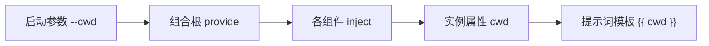

# 5-5 · 总装：组合根、编排驱动与配置注入链

> 本篇示例所需的文件、完整输入与代表性输出均在本页列出。模型生成的自然语言可能变化；本页输出用于说明控制流。
>
> 前置：第 5-3 篇“编排者设计”、第 5-4 篇“实例生命周期”；运行环境与凭证设置见[附录 A](a-appendix-environment.md)。

## 这篇讲什么

把前述概念组装为可运行系统的工程实践：组合根的位置、两种编排驱动的权衡、配置值的注入链，以及总装检查清单。本页给出一个完整的小型项目：编排者先探查计算模块并拆解 README 任务，再把写作派给 coder，最后通过命名续接要求同一实例复核交付物。

## 背景知识

组件化设计的最后一步是总装：在应用入口处实例化、连线并配置全部组件。这个位置称为组合根——整个对象图唯一集中装配之处。Agent 应用的总装除常规对象图外，还要决定编排驱动方式与运行期值的流向。

## 核心概念

### 组合根的结构

本例的 `main.py` 是组合根。它建立 Runtime、加载模型配置、注册 `cwd` 运行期值，并选择新建或恢复根 Agent。

**`pyproject.toml`**

```toml
[project]
name = "flowing-5-5-practice"
version = "0.1.0"
requires-python = ">=3.13"
dependencies = ["flowing-agent>=0.1.0"]

[tool.uv]
package = false
```

**`providers.yaml`**

```yaml
deepseek:
  adapter: deepseek
  base_url: https://api.deepseek.com
  api_key: "{{env.DEEPSEEK_API_KEY}}"
```

**`models.yaml`**

```yaml
deepseek-flash:
  provider: deepseek
  model: deepseek-v4-flash
```

**`model-tags.yaml`**

```yaml
tags:
  default: deepseek-flash
```

**`main.py`**

```python
"""多智能体应用总装入口。"""

from flowing import Runtime


async def main(cwd: str | None = None, resume: str | None = None) -> Runtime:
    runtime = Runtime(persist_dir="@/.flowing")
    # runtime.set_providers("@/providers.yaml")
    # runtime.set_models("@/models.yaml")
    runtime.set_model_tags("@/model-tags.yaml")
    if cwd:
        runtime.provide("cwd", cwd)
    if resume is not None:
        await runtime.recover_agent(resume)
    else:
        await runtime.mount("@/root.fya", agent_id="agent-main")
    return runtime
```

组合根只负责装配，不包含业务逻辑。新建与恢复是应用的策略选择：“这一次启动是新建还是续接”由组合根明确表达。

### 编排驱动的两种形态

| | 模型路由（编排者派单） | 程序化驱动（代码 fan-out） |
|---|---|---|
| 决策位置 | 模型根据任务内容判断 | 代码执行预先确定的分支 |
| 灵活性 | 高，任务描述可以变化 | 较低，分支需要预先编码 |
| 可审计性 | 从消息记录追踪决策 | 代码直接呈现决策 |
| 适用场景 | 任务结构多变、工作者异构 | 结构固定、同构批量任务 |

选择依据是任务结构的稳定性：稳定部分可以由代码驱动，减少不必要的模型路由；多变部分交给模型判断。混合使用很常见。本页完整工程展示模型路由；程序化并行的完整范例见[第 5-2 篇](5-2-organization-patterns.md)。

### 本例的 Agent 与工具

根 Agent 只能调用子智能体和 `todo` 清单工具；它负责探查、拆解与派单，不自行读写文件。Coder 才拥有读写工具，并且只能在注入的工作目录内操作。

**`root.fya`**

```yaml
description: "编程任务编排者：探查项目、拆解任务并委派实现。"
model_tag: default
tools:
  - subagent-invoke
  - ./tools/todo.py
subagents:
  - explore-agent
  - ./agents/coder
---
$system_prompt:
你是编程任务编排者。工作目录：{{ cwd }}。
1. 先派 explore-agent 查看 {{ cwd }} 中的代码结构，并在任务描述中附上这个完整工作目录；只读探查。
2. 用 todo 工具把实现类需求拆成任务清单，并向用户展示。
3. 用户确认后，把文件编写任务派给 coder；拿到结果后向用户汇总。
不要自己读写文件。
---
$script:
async def setup(self):
    self.cwd = self.inject("cwd")
```

工具调用中的 `<working-directory>` 表示由 `{{ cwd }}` 注入的运行时路径；实际运行时将该值传给 explore-agent，不把本机绝对路径写入文档。

**`tools/todo.py`**

```python
"""将逐行任务文本解析为结构化清单。"""

from pydantic import BaseModel, Field

from flowing import ScriptTool


class TodoArgs(BaseModel):
    tasks_text: str = Field(
        description="任务清单文本：每行一个任务；以 [x] 开头表示已完成"
    )


class TodoTool(ScriptTool):
    """校验任务行并返回总数、未完成数和条目。"""

    name = "todo"
    args_model = TodoArgs

    async def execute(self, *, tasks_text: str) -> dict:
        items = []
        for raw in tasks_text.splitlines():
            line = raw.strip()
            if not line:
                continue
            done = line[:3].lower() == "[x]"
            title = (line[3:] if done else line).strip().lstrip("-•").strip()
            if not title:
                raise ValueError(f"任务行为空：{raw!r}")
            items.append({"title": title, "done": done})
        if not items:
            raise ValueError("任务清单为空：至少提供一条任务")
        open_count = sum(1 for item in items if not item["done"])
        return {"total": len(items), "open": open_count, "items": items}
```

**`agents/coder/agent.fya`**

```yaml
description: "编程智能体：在给定工作目录内读写文件并交付。"
model_tag: default
tools:
  - read
  - write
  - edit
  - grep
  - glob
  - bash
  - finish
---
$system_prompt:
你是编程智能体。工作目录：{{ cwd }}。
按任务在该目录内读写文件；不要改动目录之外的文件。
完成后用 finish 交卷，summary 写明结果，files 列出改动文件。
---
$script:
async def setup(self):
    self.cwd = self.inject("cwd")
```

**`target/pkg/calc.py`**

```python
"""供 README 任务检查的最小计算模块。"""


def add(a: float, b: float) -> float:
    """返回两个数之和。"""
    return a + b


def div(a: float, b: float) -> float:
    """返回 a 除以 b；当 b 为零时抛出 ValueError。"""
    if b == 0:
        raise ValueError("除数不能为 0")
    return a / b
```

### 配置注入链

运行期值从启动参数流向工作者提示词：



每一跳只承担一个职责：`provide` 注册值，`inject` 读取值，提示词模板消费值。值沿组件层级上溯查找，因此根节点注册一次后，子 Agent 也可获取它。审查装配时，应能在每个运行期值的链上找到入口与出口。

### 完整输入与代表性对话

先让编排者探查并拆解任务，再授权它派出 coder，最后通过命名续接要求同一 coder 自检。下面的文件内容、输入与工具交互均在本页给出；模型措辞和自然语言回复可能随运行变化。

**输入 1**

```text
先只读探查工作目录中的代码结构，并用 todo 把“为这个计算模块写 README.md”拆成任务清单。先不要派 coder。
```

**输入 2**

```text
按刚才的任务清单，派 coder 在工作目录中创建 README.md。给这个 coder 命名为 readme-writer，并让它完成后汇报改动文件。
```

**输入 3**

```text
续接 readme-writer，让它重新读取 README.md 和 pkg/calc.py，逐项核对 API 与除零行为；若有错误就修正，然后用 finish 汇报核对结果。
```

**代表性对话与工具输出**

```text
(agent-main)>>> 先只读探查工作目录中的代码结构，并用 todo 把“为这个计算模块写 README.md”拆成任务清单。先不要派 coder。
[thinking] (reasoning trace omitted)
[tool_call] subagent-invoke {"agent_type":"explore-agent","name":"explore-target","prompt":"只读检查 <working-directory>，汇报目录结构与各文件用途，不要修改文件。"}
[tool:completed] subagent-invoke -> {"summary":"项目包含 pkg/calc.py，导出 add(a, b) 和 div(a, b)；b 为零时 div 抛出 ValueError。目前没有 README.md。","files":["pkg/calc.py"]}
[tool_call] todo {"tasks_text":"1. 说明模块及其用途。\n2. 记录 add 与 div 的签名及返回值。\n3. 说明除数为零时的错误。\n4. 添加最小用法示例。\n5. 重新读取 README 与计算模块并核对一致性。"}
[tool:completed] todo -> {"total":5,"open":5,"items":[{"title":"1. 说明模块及其用途。","done":false},{"title":"2. 记录 add 与 div 的签名及返回值。","done":false},{"title":"3. 说明除数为零时的错误。","done":false},{"title":"4. 添加最小用法示例。","done":false},{"title":"5. 重新读取 README 与计算模块并核对一致性。","done":false}]}
本轮完成了只读探查和任务拆解。工作目录中有一个计算模块，尚无 README；请确认后我再派 coder 编写。
(agent-main)>>> 按刚才的任务清单，派 coder 在工作目录中创建 README.md。给这个 coder 命名为 readme-writer，并让它完成后汇报改动文件。
[thinking] (reasoning trace omitted)
[tool_call] subagent-invoke {"agent_type":"coder","name":"readme-writer","prompt":"请在给定工作目录中创建 README.md。先读取 pkg/calc.py，说明模块用途，记录 add(a, b) 与 div(a, b)，注明除数为零时 div 会抛出 ValueError，并附上最小 Python 用法示例。不要修改 calc.py 或工作目录之外的文件。完成后用简洁摘要和改动文件清单汇报。"}
[tool:completed] subagent-invoke -> {"summary":"已创建 README.md，包含模块介绍、API 说明、除数为零时的行为和用法示例。","files":["README.md"]}
(agent-main)>>> 续接 readme-writer，让它重新读取 README.md 和 pkg/calc.py，逐项核对 API 与除零行为；若有错误就修正，然后用 finish 汇报核对结果。
[thinking] (reasoning trace omitted)
[tool_call] subagent-invoke {"resume":"readme-writer","prompt":"重新读取 README.md 和 pkg/calc.py，核对文档中的签名、返回值、除数为零时的行为和用法示例是否一致。若有差异就修正，然后用 finish 逐项汇报核对结果并列出改动文件。"}
[tool:completed] subagent-invoke -> {"summary":"已重新读取两个文件。文档中的签名、返回值、除数为零时的行为和用法示例均与实现一致，无需修正。","files":["README.md"]}
```

下面给出一份完整 README 示例输出。LLM 生成的实际措辞可能不同；这份内容对应上方明确列出的模块接口与行为。

**代表性生成结果：`README.md`**

````markdown
# 计算器模块

一个提供加法和除法函数的简易 Python 模块。

## API

### `add(a: float, b: float) -> float`

返回 `a` 与 `b` 的和。

### `div(a: float, b: float) -> float`

返回 `a` 除以 `b` 的结果。`b` 为零时抛出 `ValueError`。

## 用法

```python
from pkg.calc import add, div

print(add(2, 3))  # 5
print(div(8, 2))  # 4.0
```
````

逐项看总装链路：编排者用 explore 探查，用 `todo` 拆解，再将编写任务派给 coder。第二轮通过 `resume="readme-writer"` 续接同一个实例，使它能基于已有上下文复核交付物。模型负责处理自然语言任务边界；代码负责装配组件与提供受限能力。

### 总装检查清单

1. 目录条目的描述是否说清任务类型边界？
2. 编排者的工具表是否最小化，没有代替工作者执行任务？
3. 多轮协作的工作者是否命名，并按需续接？
4. 每个运行期值是否经过显式的 `provide → inject → 模板` 链？
5. 新建与恢复分支是否由组合根显式表达？

本例中，根 Agent 只负责唤起子智能体和拆解任务；coder 按需创建并命名续接；`--cwd` 经注入链传递；`main.py` 明确区分新建与恢复。

## 运行本例

在一个练习目录中按上文文件名创建并填入所有代码与配置。附录 A 说明如何准备 Python、uv、包依赖和 API 凭证。以下命令不需要切换到其他目录；`$PWD` 会在当前 shell 中解析为练习目录的位置。

```console
export DEEPSEEK_API_KEY=sk-your-key-here
uv sync
uv run flowing repl . --cwd "$PWD/target" <<'FLOWING_INPUT'
先只读探查工作目录中的代码结构，并用 todo 把“为这个计算模块写 README.md”拆成任务清单。先不要派 coder。
按刚才的任务清单，派 coder 在工作目录中创建 README.md。给这个 coder 命名为 readme-writer，并让它完成后汇报改动文件。
续接 readme-writer，让它重新读取 README.md 和 pkg/calc.py，逐项核对 API 与除零行为；若有错误就修正，然后用 finish 汇报核对结果。
/exit
FLOWING_INPUT
```

命令中的 `sk-your-key-here` 只是占位符，请替换为你自己的服务商凭证；不要把真实凭证写进文件或文档。对话生成的 README 文本可能变化，可对照上面的完整代表性版本检查结构与语义。

## 常见误区

1. **组合根掺入业务逻辑。** 装配与逻辑混写，会让组件构造过程难以单独审查。
2. **编排驱动一刀切。** 用模型路由处理稳定批量任务会产生不必要的路由开销；把多变任务硬编码则会绑定当前结构。
3. **运行期值隐式传递。** 绕过 `provide → inject → 模板` 链，会使值的来源难以追踪。

## 练习

1. 为“周报生成系统”画出组合根，标明编排者、数据工作者、写作工作者、装配顺序，以及目标周和输出目录的注入链。
2. 用五项检查清单评审本页内联的 `main.py`、`root.fya` 与 coder 配置，并指出每项的依据。
3. 暂时从运行命令中移除 `--cwd` 后运行，观察缺少运行期值时哪个组件先暴露问题；不要把真实凭证写入命令以外的文件。

## 小结

1. 组合根负责纯装配，并显式选择新建或恢复。
2. 编排驱动应依据任务结构稳定性选择：模型路由灵活，程序化驱动确定，混合使用很常见。
3. 配置注入链是 `provide → inject → 模板`，每一跳职责单一。
4. 总装检查清单涵盖目录描述、编排者工具表、命名续接、注入链与恢复分支。
